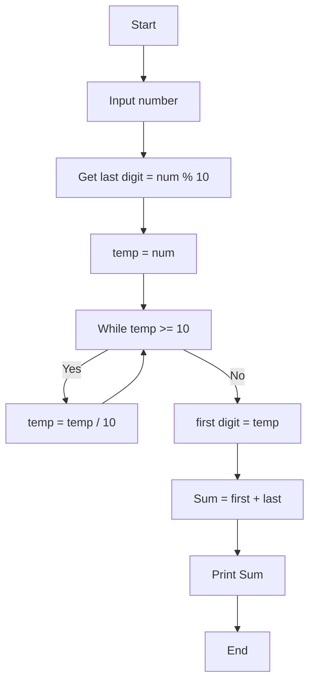
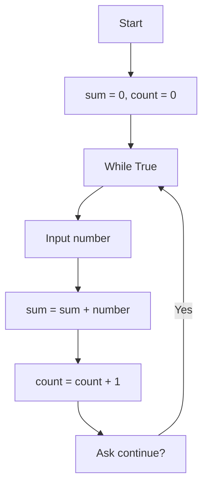
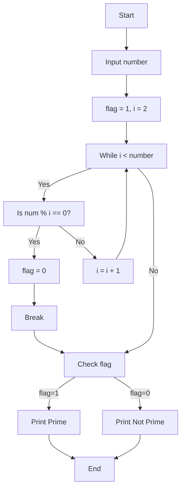
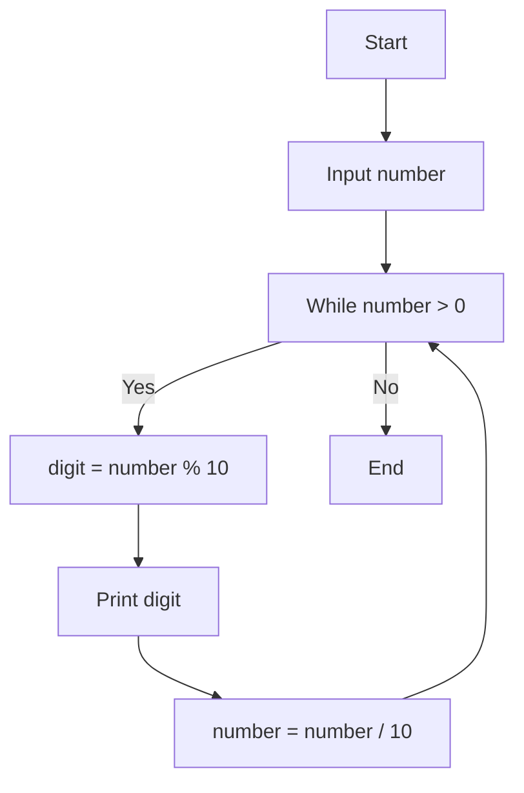
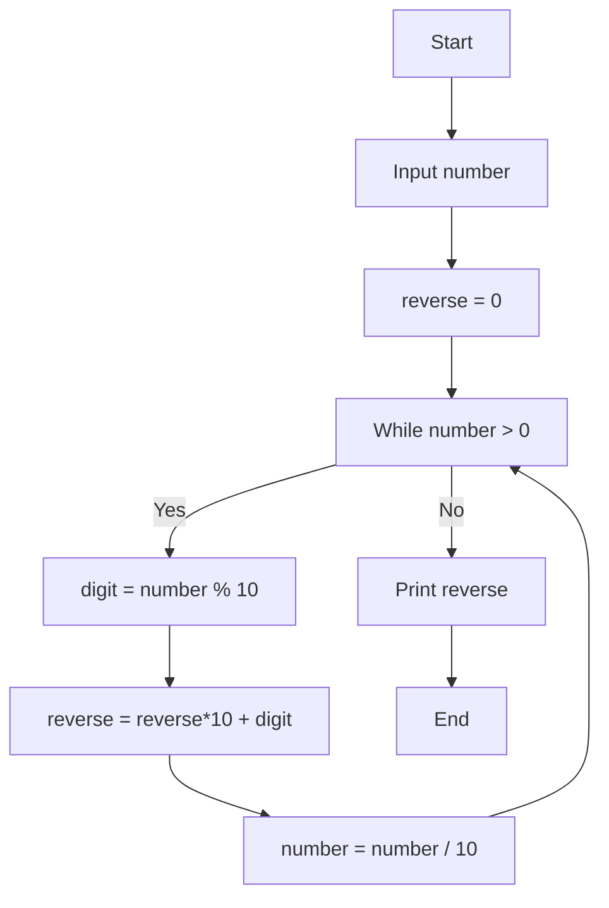
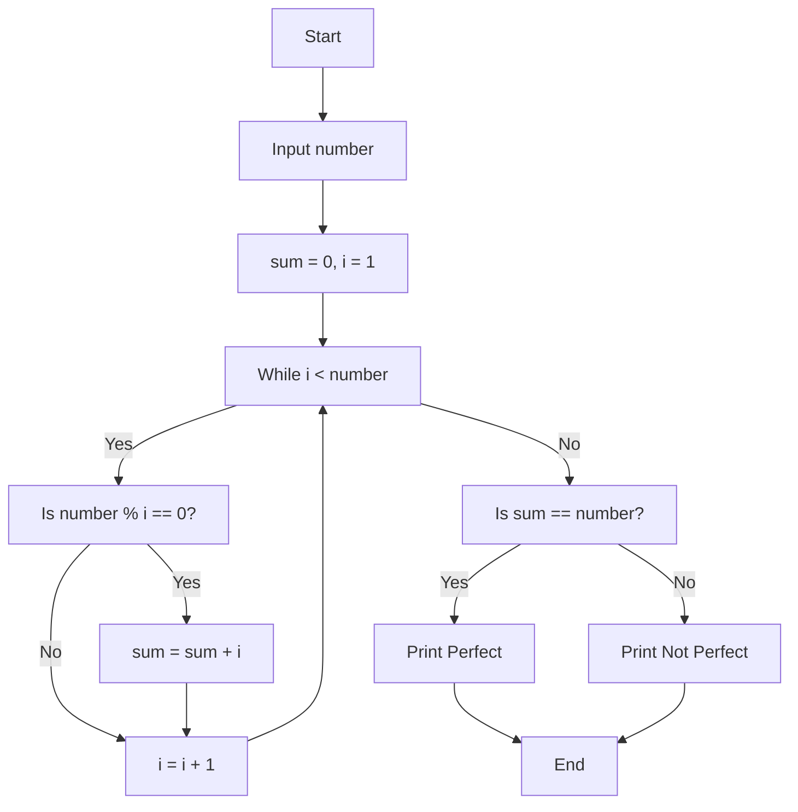
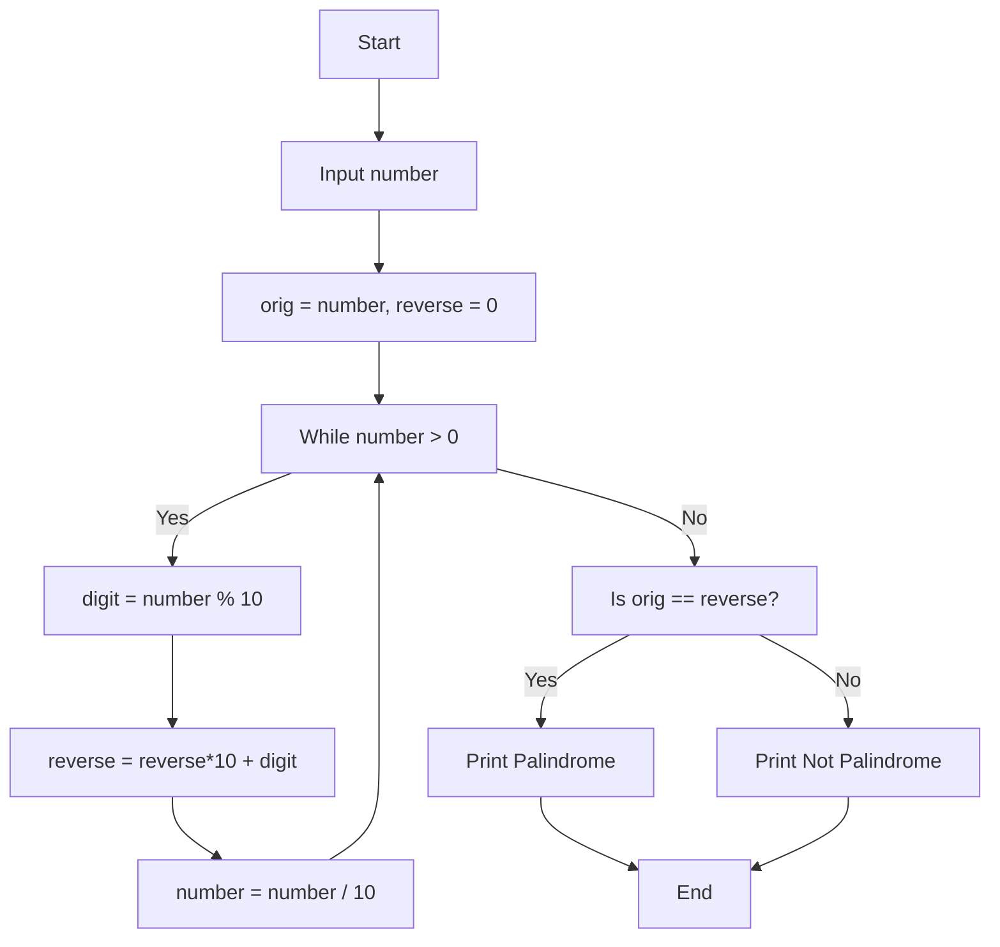
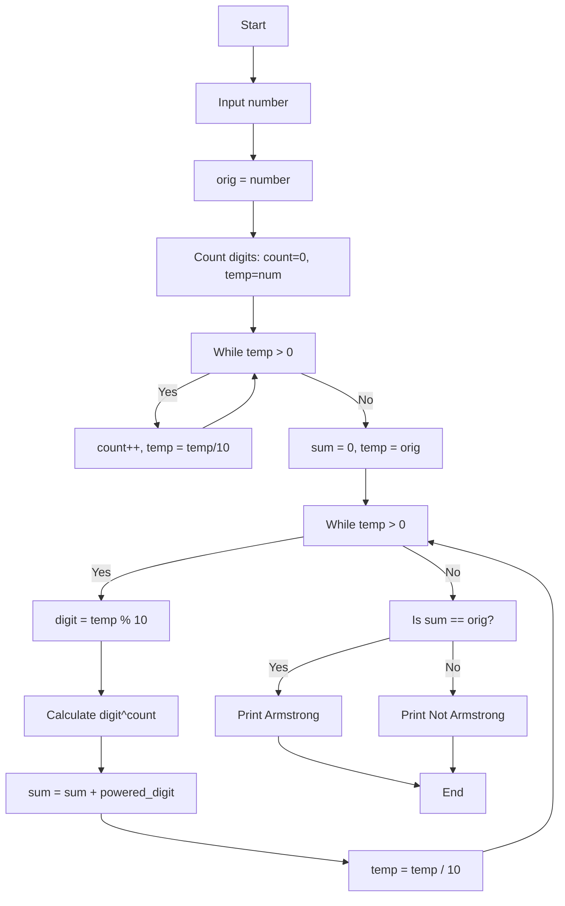
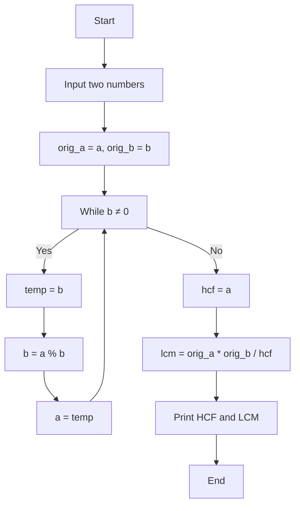

# Lab 10: While Loops and Number Properties

In this lab, we explore **while loops** by solving various problems related to **number properties** like digits, primes, perfect numbers, and Armstrong numbers.

---

## SECTION A: Basic Number Operations

---

### **A_1: Sum of First and Last Digit**

#### 💡 Problem
Find the sum of the **first digit** and **last digit** of a given number.

#### 📝 Example Trace
```
Input: 5348
Last digit: 5348 % 10 = 8
First digit: Keep dividing until single digit = 5
Sum: 5 + 8 = 13
Output: 13
```

#### 🧠 Logic Explanation
- **Last Digit:** Use modulus operator `num % 10`
- **First Digit:** Keep dividing by 10 until only one digit remains

#### 📊 Flowchart

---

### **A_2: Sum and Average of Multiple Numbers**

#### 💡 Problem
Accept numbers from the user **one by one** until they choose to stop. Then display the **sum** and **average**.

#### 📝 Example Trace
```
User enters: 10, 20, 15, 25 (then stops)
Sum = 10 + 20 + 15 + 25 = 70
Count = 4
Average = 70 / 4 = 17.5
```

#### 🧠 Logic Explanation
- Keep asking for numbers until user says "no"
- Add each number to a running total
- Count how many numbers were entered
- Calculate average = sum / count

#### 📊 Flowchart


---

### **A_3: Check if Prime Number**

#### 💡 Problem
A **prime number** has exactly 2 factors: 1 and itself. Determine if a given number is prime.

#### 📝 Example Trace
```
Input: 17
Check: Is 17 divisible by 2? No
       Is 17 divisible by 3? No
       Is 17 divisible by 4? No
       ... (up to 16)
No divisors found → Prime!

Input: 12
Check: Is 12 divisible by 2? YES!
Found a divisor → Not Prime!
```

#### 🧠 Logic Explanation
- Check each number from 2 to (num-1)
- If any number divides it evenly, it's **not prime**
- If no divisors found, it's **prime**
- Use flag variable: 1 = prime, 0 = not prime

#### 📊 Flowchart


---

### **A_4: Print Digits of Given Number**

#### 💡 Problem
Extract and print each digit of a number separately.

#### 📝 Example Trace
```
Input: 5348
Extract: 5348 % 10 = 8 → Print 8
         534 % 10 = 4 → Print 4
         53 % 10 = 3 → Print 3
         5 % 10 = 5 → Print 5
Output: 8 4 3 5 (printed right to left)
```

#### 🧠 Logic Explanation
- Last digit of number = `num % 10`
- After extracting, remove last digit = `num / 10`
- Repeat until no digits remain

#### 📊 Flowchart



---

### **A_5: Print Number in Reverse Order**

#### 💡 Problem
Read a number and print it backwards (e.g., 1234 → 4321).

#### 📝 Example Trace
```
Input: 1234
reverse = 0
Step 1: digit = 1234 % 10 = 4
        reverse = (0 * 10) + 4 = 4
        num = 1234 / 10 = 123

Step 2: digit = 123 % 10 = 3
        reverse = (4 * 10) + 3 = 43
        num = 123 / 10 = 12

Step 3: digit = 12 % 10 = 2
        reverse = (43 * 10) + 2 = 432
        num = 12 / 10 = 1

Step 4: digit = 1 % 10 = 1
        reverse = (432 * 10) + 1 = 4321
        num = 1 / 10 = 0

Output: 4321
```

#### 🧠 Logic Explanation
- Build reverse number step by step
- Each step: `reverse = (reverse * 10) + last_digit`
- This "shifts" digits left and adds the new digit at the end

#### 📊 Flowchart


---

## SECTION B: Number Properties

---

### **B_1: Check if Perfect Number**

#### 💡 Problem
A **perfect number** equals the sum of its **proper divisors** (all divisors except itself).
Example: 6 = 1 + 2 + 3

#### 📝 Example Trace
```
Input: 6
Divisors: 1, 2, 3
Sum: 1 + 2 + 3 = 6
6 == 6 → Perfect!

Input: 12
Divisors: 1, 2, 3, 4, 6
Sum: 1 + 2 + 3 + 4 + 6 = 16
12 ≠ 16 → Not Perfect
```

#### 🧠 Logic Explanation
- Find all numbers that divide the given number evenly
- Add them together (excluding the number itself)
- Compare sum with original number

#### 📊 Flowchart


---

### **B_2: Check if Prime Using Flag**

#### 💡 Problem
Same as A_3, but demonstrates using a **flag variable** more clearly.

#### 📝 Example Trace
```
Input: 7
flag = 1 (assume prime)
Check i=2: 7%2 ≠ 0 → continue
Check i=3: 7%3 ≠ 0 → continue
Check i=4: 7%4 ≠ 0 → continue
Check i=5: 7%5 ≠ 0 → continue
Check i=6: 7%6 ≠ 0 → continue
Loop ends (i=7, not < 7)
flag = 1 → Prime!
```

#### 🧠 Logic Explanation
- **Flag = 1:** Number is prime
- **Flag = 0:** Number is not prime
- As soon as we find a divisor, set flag to 0 and break

---

### **B_3: Check if Palindrome**

#### 💡 Problem
A **palindrome number** reads the same forwards and backwards.
Example: 121, 1331, 5

#### 📝 Example Trace
```
Input: 121
Original: 121
Reverse: Extract digits and rebuild
  - digit = 121 % 10 = 1
  - reverse = (0*10) + 1 = 1
  - num = 121/10 = 12
  
  - digit = 12 % 10 = 2
  - reverse = (1*10) + 2 = 12
  - num = 12/10 = 1
  
  - digit = 1 % 10 = 1
  - reverse = (12*10) + 1 = 121
  - num = 1/10 = 0

121 == 121 → Palindrome!
```

#### 🧠 Logic Explanation
- Store the original number
- Use the same logic from A_5 to create reversed number
- Compare original with reverse

#### 📊 Flowchart

---

## SECTION C: Advanced Number Properties

---

### **C_1: Check if Armstrong Number**

#### 💡 Problem
An **Armstrong number** (narcissistic number) equals the sum of its digits raised to the power of the number of digits.

Example: 153
- Digits: 1, 5, 3 (3 digits total)
- Calculation: 1³ + 5³ + 3³ = 1 + 125 + 27 = 153 ✓

#### 📝 Example Trace
```
Input: 153
Step 1: Count digits
  count = 0
  temp = 153
  Loop: temp = 153 → count = 1
        temp = 15 → count = 2
        temp = 1 → count = 3
  count = 3

Step 2: Calculate sum of digits raised to power 3
  temp = 153
  - digit = 153 % 10 = 3, sum = 0 + 3³ = 27
  - temp = 15
  - digit = 15 % 10 = 5, sum = 27 + 5³ = 152
  - temp = 1
  - digit = 1 % 10 = 1, sum = 152 + 1³ = 153
  - temp = 0

Step 3: Compare
  153 == 153 → Armstrong!
```

#### 🧠 Logic Explanation
1. Count total number of digits
2. For each digit, raise it to power of count
3. Sum all these powered digits
4. Compare with original number

#### 📊 Flowchart


---

### **C_2: Find HCF and LCM of Two Numbers**

#### 💡 Problem
- **HCF (Highest Common Factor):** Largest number that divides both numbers
- **LCM (Least Common Multiple):** Smallest number divisible by both

Formula: `LCM × HCF = Number1 × Number2`

#### 📝 Example Trace
```
Input: 12 and 18

Find HCF using Euclidean Algorithm:
  a=12, b=18
  Step 1: b ≠ 0, so temp=18, b=12%18=12, a=18
  Step 2: b ≠ 0, so temp=12, b=18%12=6, a=12
  Step 3: b ≠ 0, so temp=6, b=12%6=0, a=6
  Step 4: b == 0, stop
  HCF = 6

Find LCM:
  LCM = (12 × 18) / 6 = 216 / 6 = 36
```

#### 🧠 Logic Explanation
- **HCF:** Use Euclidean algorithm (keep swapping and finding remainders)
- **LCM:** Use formula: LCM = (a × b) / HCF

#### 📊 Flowchart


---

### **C_3: Output Tracing**

#### 💡 Problem
Analyze and predict the output of a given C program.

---

## Key Concepts Summary

| Concept | Explanation |
| :--- | :--- |
| **While Loop** | Repeats code as long as condition is true |
| **Loop Counter** | Variable that changes each iteration (prevents infinite loop) |
| **Break Statement** | Exits loop immediately |
| **Modulus (%)** | Gives remainder (useful for extracting digits) |
| **Division (/)** | Integer division removes decimal (useful for removing digits) |
| **Flag Variable** | Boolean-like variable (1=true, 0=false) |
| **Prime Number** | Has no divisors except 1 and itself |
| **Perfect Number** | Sum of divisors equals the number |
| **Palindrome** | Reads same forwards and backwards |
| **Armstrong Number** | Sum of digits raised to power of digit count |

---

## Common Mistakes to Avoid

❌ **Mistake 1:** Forgetting to update loop counter
```c
while(i < 10) {
    printf("%d", i);  // i never changes → infinite loop!
}
```

✓ **Fix:** Always update the counter
```c
while(i < 10) {
    printf("%d", i);
    i = i + 1;  // Now loop will eventually end
}
```

---

❌ **Mistake 2:** Wrong digit extraction order
```c
num = 5348;
digit = num / 10;  // This gives 534, not the digit 3
```

✓ **Fix:** Use modulus for last digit
```c
num = 5348;
digit = num % 10;  // This gives 8 (correct last digit)
```

---

❌ **Mistake 3:** Forgetting to store original value
```c
int num;
scanf("%d", &num);
while(num > 0) {
    // ... modifying num ...
}
// Now num is 0, can't use original value!
```

✓ **Fix:** Save original before modifying
```c
int num, orig;
scanf("%d", &num);
orig = num;  // Save original
while(num > 0) {
    // ... modifying num ...
}
// Still have orig for later comparison
```

---

## Practice Questions

1. What is the output of a while loop with condition `i < 5` if `i` starts at 1 and increments each iteration?
2. Why do we need to use `orig = num` before entering a while loop that modifies `num`?
3. What's the difference between using `num % 10` and `num / 10`?
4. How do flag variables help in checking number properties?
5. Can we check if a number is prime without using a flag? How?

