# Lab 11: For Loops and Iterative Calculations

In this lab, we use `for` loops to repeat a fixed set of instructions. The programs cover counting, sums, tables, powers, factorials, sequences, digit processing, ASCII values, and nested loops.

---

## `for` Loop Basics

A `for` loop is useful when a group of statements must be repeated a known number of times. It keeps the loop setup, continuation check, and counter update together.

### General Syntax

```text
for (initializer; condition; update statement)
{
    statements to repeat
}
```

- **Initializer:** Runs once, before the first condition check. It usually creates or sets the loop counter, such as `i = 1`.
- **Condition:** Checked before every iteration. If it is true, the loop body runs; if it is false, the loop ends.
- **Update statement:** Runs after the loop body. It usually changes the counter, such as `i++`.
- The two semicolons are required, even when one or more parts are omitted.

### Program Flow

1. Execute the initializer once.
2. Check the condition.
3. If the condition is true, execute the loop body.
4. Execute the update statement.
5. Return to the condition check.
6. Stop when the condition is false.

The order is therefore: **initialize -> check -> execute -> update -> check again**.

### Different `for` Loop Forms

#### 1. Normal `for` Loop

All three parts are written inside the parentheses:

```text
for (initializer; condition; update statement)
{
    print i
}
```

Example:

```text
for (i = 1; i <= 3; i++)
{
    print i
}
```

This prints `1 2 3`.

#### 2. Optional Initializer

The initializer can be placed before the loop, leaving its section empty:

```text
for (; condition; update statement)
{
    print i
}
```

Example:

```text
i = 1
for (; i <= 3; i++)
{
    print i
}
```

The initializer is before the loop, and this prints `1 2 3`.

#### 3. Optional Condition

The condition can be omitted. It is treated as always true, so the loop needs a `break` or another exit path:

```text
for (initializer; ; update statement)
{
    print i
    if (i > 3)
        break
}
```

Example:

```text
for (i = 1; ; i++)
{
    if (i > 3)
        break
    print i
}
```

The loop keeps running until the body stops it with `break`.

#### 4. Optional Update Statement

The update statement can be omitted. The counter can be changed inside the loop body instead:

```text
for (initializer; condition; )
{
    print i
    increase i by 1
}
```

Example:

```text
for (i = 1; i <= 3; )
{
    print i
    increase i by 1
}
```

The update is inside the loop body, and this prints `1 2 3`.

#### 5. All Three Parts Optional

All three parts can be omitted. This creates an infinite loop unless the body contains a way to stop it:

```text
for (;;)
{
    print i
    if (i > 3)
        break
    increase i by 1
}
```

Example:

```text
i = 1
for (;;)
{
    print i
    if (i >= 3)
        break
    increase i by 1
}
```

All three parts are omitted, so the body must provide the stopping logic.

These forms still follow the same flow. Only the omitted part changes: there is no initializer to run, no condition to make false, or no automatic update after the body.

---

## SECTION A: Basic `for` Loop Operations

---

### **A_1a: Print Numbers from 1 to 10**

#### Problem
Print the numbers from 1 to 10 in increasing order.

#### Logic Explanation
- Start the loop counter at 1.
- Continue while the counter is less than or equal to 10.
- Print the counter and increase it by 1 after every iteration.

#### Flowchart
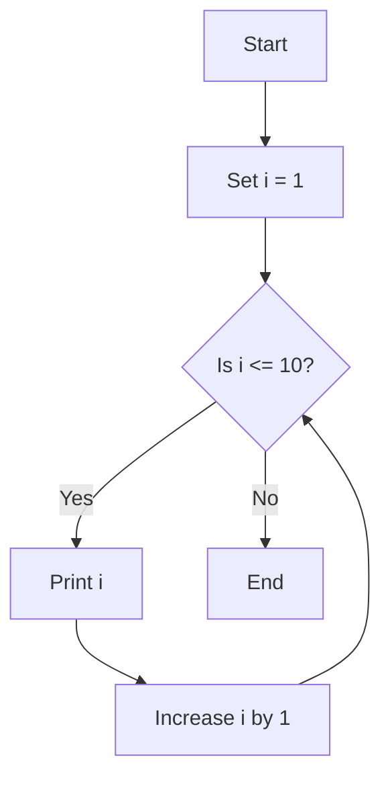

---

### **A_1b: Print Numbers from 1 to n**

#### Problem
Read `n` and print all integers from 1 through `n`.

#### Example
```text
Input: n = 5
Output: 1 2 3 4 5
```

#### Logic Explanation
- Read the ending value `n`.
- Start `i` at 1.
- Print `i` while `i <= n`.
- Increase `i` by 1 each time.

#### Flowchart
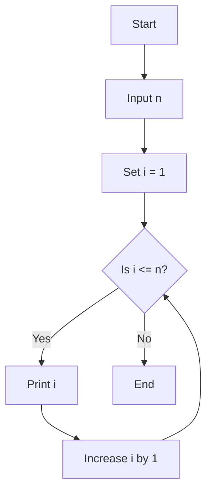

---

### **A_2: Sum of Numbers from 1 to n**

#### Problem
Find the sum of all integers from 1 through `n`.

#### Example Trace
For `n = 5`:

| Iteration | `i` | Sum after addition |
| ---: | ---: | ---: |
| 1 | 1 | 1 |
| 2 | 2 | 3 |
| 3 | 3 | 6 |
| 4 | 4 | 10 |
| 5 | 5 | 15 |

Output: `Sum = 15`

#### Logic Explanation
- Initialize `sum` to 0.
- Add each value of `i` to `sum`.
- Stop after adding `n`.
- Display the final sum.

#### Flowchart
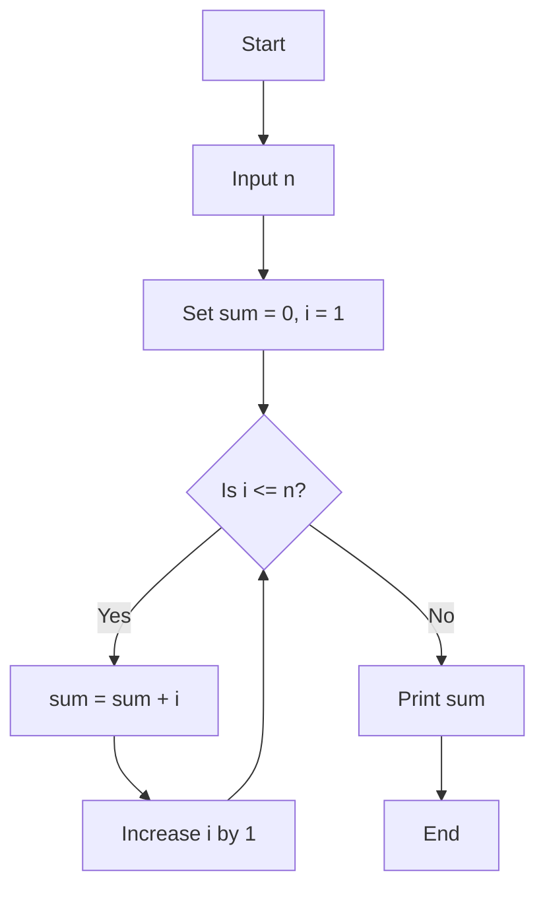

---

### **A_3: Multiplication Table**

#### Problem
Read a number and print its multiplication table from 1 to 10.

#### Example
```text
Input: 7
Output:
7 x 1 = 7
7 x 2 = 14
...
7 x 10 = 70
```

#### Logic Explanation
- Read the number.
- Use a counter from 1 to 10.
- Multiply the input number by the counter.
- Print the result for every iteration.

#### Flowchart
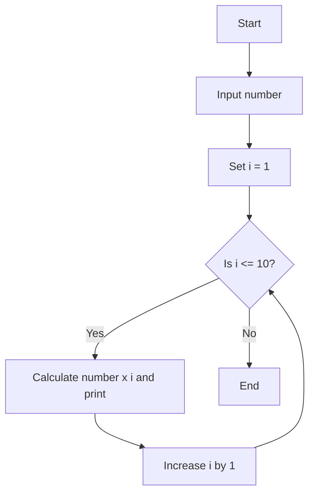

---

### **A_4: Calculate x^y without a Power Function**

#### Problem
Calculate `x` raised to the power `y` without using a built-in power function.

#### Example
```text
Input: x = 3, y = 4
result: 1 -> 3 -> 9 -> 27 -> 81
Output: 3^4 = 81
```

#### Logic Explanation
- Start `result` at 1.
- Repeat `y` times.
- Multiply `result` by `x` during each repetition.
- After the loop, `result` contains `x^y`.

#### Flowchart
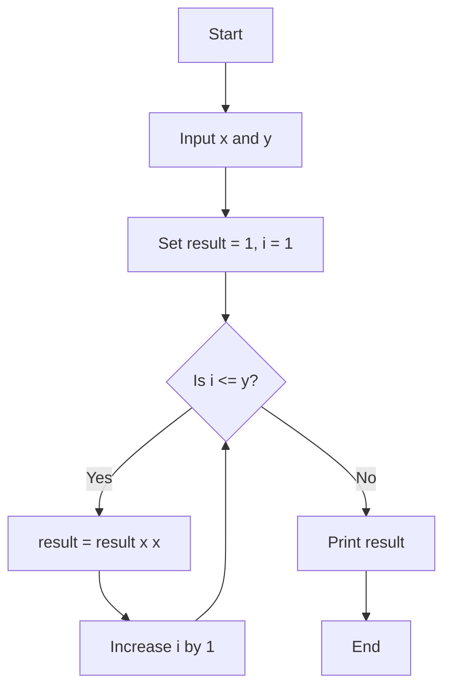

---

### **A_5: Factorial of a Number**

#### Problem
Find the factorial of a non-negative integer. The factorial is the product of all positive integers up to that number.

#### Example
```text
Input: 5
fact: 1 -> 1 -> 2 -> 6 -> 24 -> 120
Output: Factorial = 120
```

#### Logic Explanation
- Start `fact` at 1.
- Multiply it by every integer from 1 through `n`.
- Print the final product.
- For `n = 0`, the loop does not multiply anything, so the result remains 1.

#### Flowchart
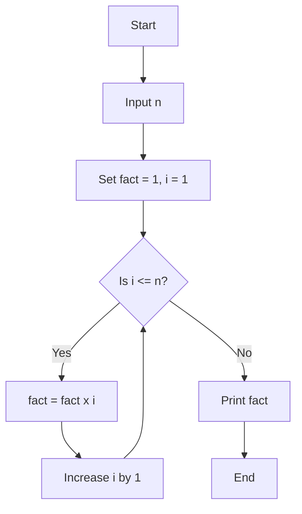

---

## SECTION B: Sequences and Digit Information

---

### **B_1: Fibonacci Series**

#### Problem
Print the first `n` terms of the Fibonacci series, starting with 0 and 1.

#### What is the Fibonacci Series?
The Fibonacci series is a sequence in which each term is found by adding the previous two terms. It usually starts with 0 and 1:

```text
0, 1, 1, 2, 3, 5, 8, 13, ...
```

For example, `1 + 1 = 2`, `1 + 2 = 3`, and `2 + 3 = 5`.

#### Example
```text
Input: n = 7
Output: 0 1 1 2 3 5 8
```

#### Logic Explanation
- Start with `a = 0` and `b = 1`.
- Print `a` as the current term.
- Find the next term by adding `a` and `b`.
- Move `b` into `a`, and move the new sum into `b`.
- Repeat until `n` terms are printed.

#### Flowchart
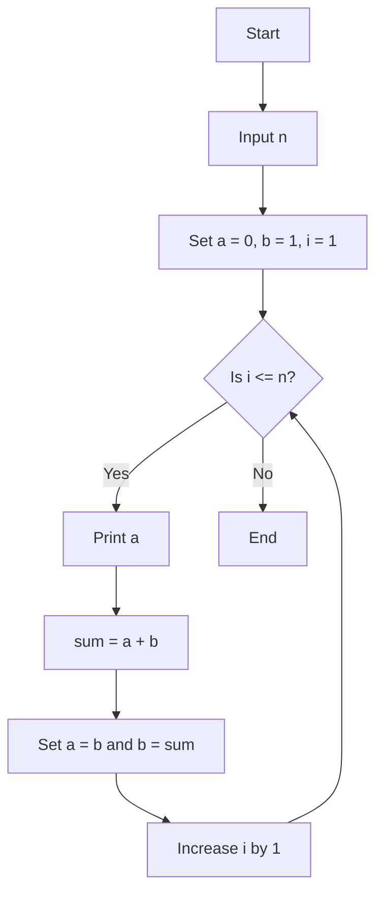

---

### **B_2: Frequency of Digits**

#### Problem
Count how many times each digit from 0 to 9 occurs in an integer. Only digits that occur are displayed.

#### Example
```text
Input: 12021
Digits examined from right to left: 1, 2, 0, 2, 1
Output:
0 occurs 1 times
1 occurs 2 times
2 occurs 2 times
```

#### Logic Explanation
- Convert a negative input to its positive value.
- Extract the last digit using the remainder after division by 10.
- Increase the counter belonging to that digit.
- Remove the last digit using integer division by 10.
- Repeat until no digits remain.
- Check the ten counters and print the non-zero ones.

#### Flowchart
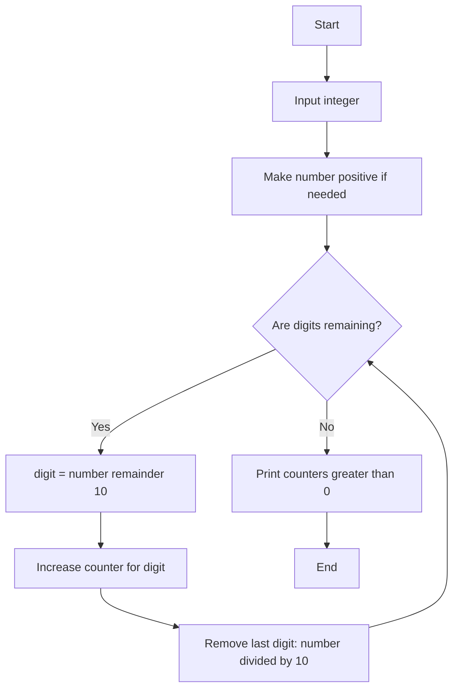

Note: With input `0`, this implementation does not enter the digit-extraction loop, so it does not print a frequency for zero.

---

### **B_3: ASCII Values and Characters**

#### Problem
Print every integer value from 0 to 127 with its corresponding ASCII character.

#### Example
```text
0 = [control character]
1 = [control character]
...
48 = 0
65 = A
97 = a
127 = [control character]
```

#### Logic Explanation
- Start an integer counter at 0.
- Continue through 127.
- Print the counter as an integer and as a character.
- Increase the counter by 1.

Some values are control characters, so their output may not be visibly printable.

#### Flowchart
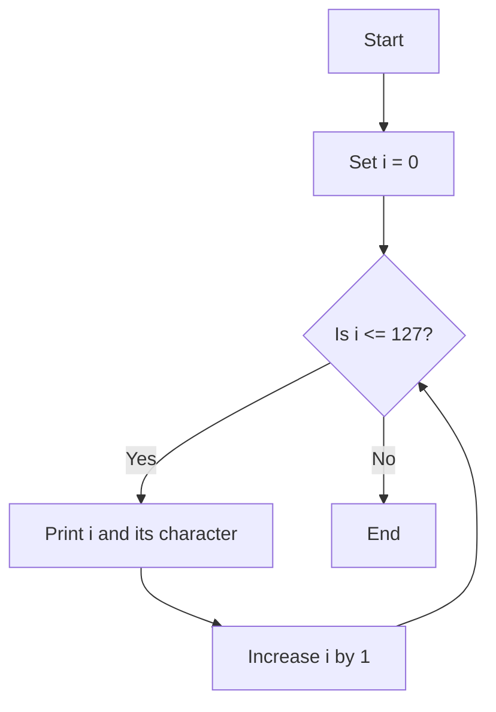

---

## SECTION C: More Complex Iterations

---

### **C_1: Swap the First and Last Digits**

#### Problem
Exchange the first digit and the last digit of a number while keeping the middle digits in the same order.

#### Example
```text
Input: 12345
First digit: 1
Last digit: 5
Middle digits: 234
Output: 52341
```

#### Logic Explanation
- Find the place value of the first digit by repeatedly dividing a temporary copy by 10.
- The first digit is the number divided by that place value.
- The last digit is the remainder after division by 10.
- Remove the first and last digits to obtain the middle portion.
- Rebuild the number with the last digit first, the middle portion next, and the first digit last.

#### Flowchart
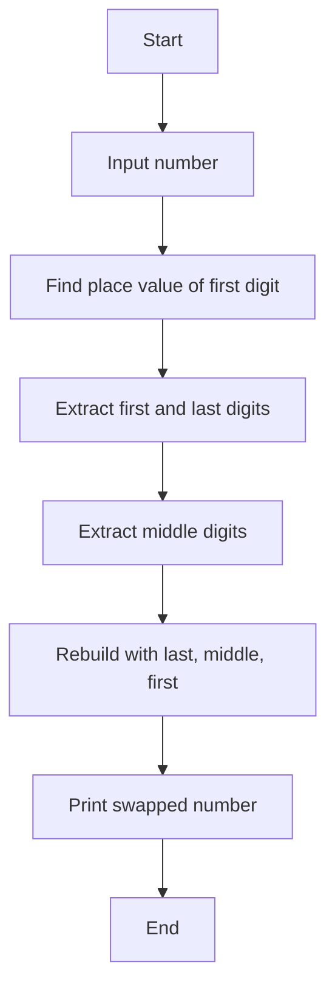

This logic is intended for a positive multi-digit integer. For a one-digit number, the first and last digits are the same.

---

### **C_2: Calculate x^y without Power or Multiplication**

#### Problem
Calculate `x^y` without using a power function or the multiplication operator.

#### Example
```text
Input: x = 3, y = 3

Start result = 1
First outer loop: add 1 three times  -> 3
Second outer loop: add 3 three times -> 9
Third outer loop: add 9 three times  -> 27

Output: 3^3 = 27
```

#### Logic Explanation
- Start `result` at 1.
- The outer loop repeats once for every power of `x`.
- Set a temporary value to 0 at the start of each outer iteration.
- The inner loop adds `result` to the temporary value `x` times. This performs multiplication through repeated addition.
- Replace `result` with the temporary value.
- After `y` outer iterations, `result` contains `x^y`.

The program assumes non-negative values for `x` and `y`, because the inner loop uses `x` as its repetition limit.

#### Flowchart
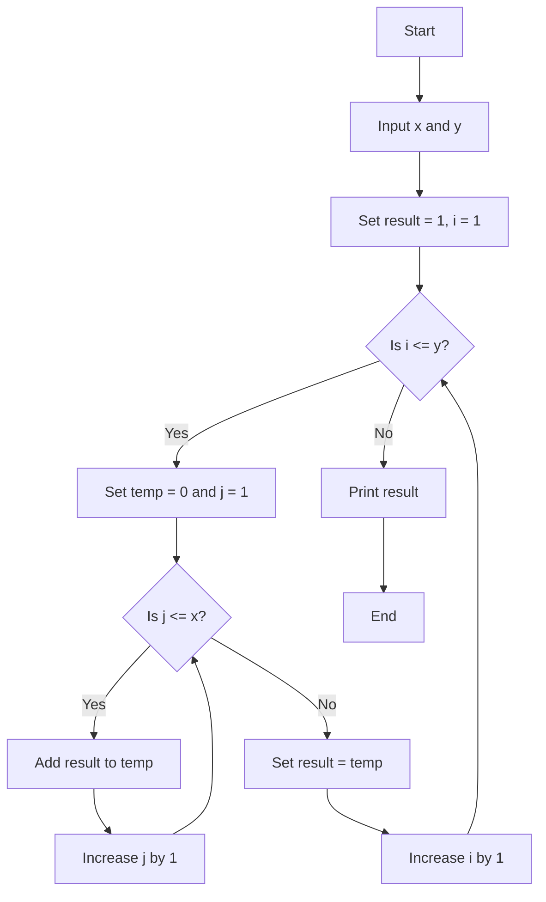

---

## Quick Review

| Program | Main idea |
| --- | --- |
| A_1a | Fixed counting loop from 1 to 10 |
| A_1b | Counting loop with a user-defined limit |
| A_2 | Accumulator for a running sum |
| A_3 | Repeated multiplication for a table |
| A_4 | Repeated multiplication for a power |
| A_5 | Running product for factorial |
| B_1 | Update two values to generate a sequence |
| B_2 | Extract digits and update frequency counters |
| B_3 | Iterate through the ASCII integer range |
| C_1 | Extract and rebuild number parts |
| C_2 | Nested loops and repeated addition |

## Important Points

- Initialize a sum or product before entering its loop.
- Check whether the loop should use `<` or `<=`.
- Update the loop counter so that the loop eventually ends.
- Integer division removes the fractional part, which is useful for digit extraction.
- A nested loop completes all of its inner iterations for every outer iteration.
- The values of `x` and `y` should be small enough that the result fits inside an `int`.
