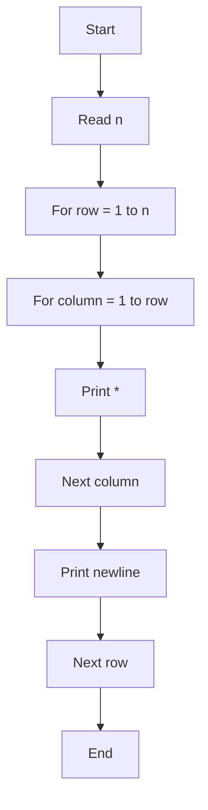
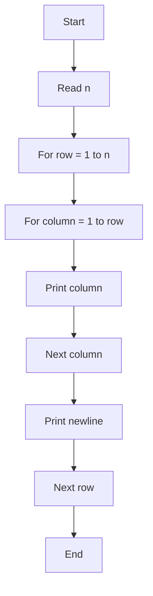
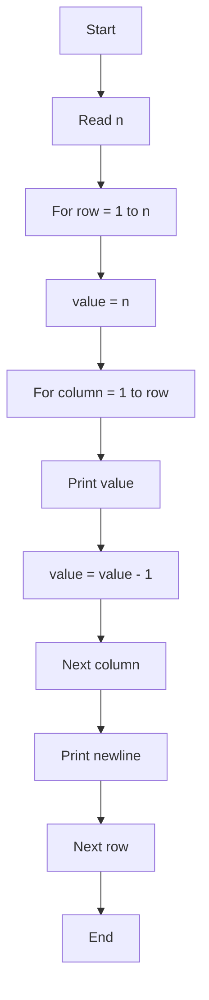
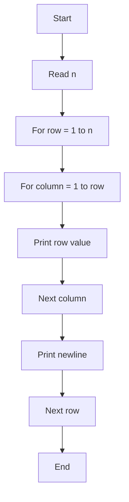
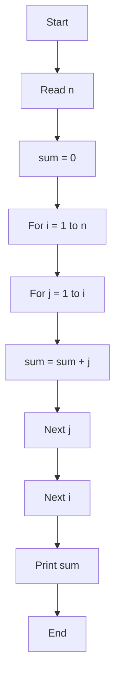
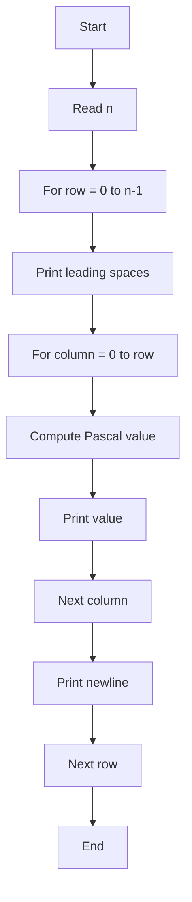

# Lab 12: Basics of Patterns

In this lab, we learn how to print pattern programs using **nested `for` loops**. A pattern is a sequence of symbols, numbers, or characters arranged in rows and columns. The main idea is to understand the relationship between the **row count** and the **item count inside each row**.

---

## What Are Patterns?

A pattern program prints a visual design using repeated loops. In C, a pattern is usually created with:

- An **outer loop** that controls the **number of rows**.
- An **inner loop** that controls the **number of items in each row**.

The simplest structure is:

```text
for (row = 1; row <= n; row++)
{
    for (column = 1; column <= something; column++)
    {
        print something
    }
    print new line
}
```

### Important Pattern Thinking

1. `outer loop` = number of rows
2. `inner loop` = number of columns/items in that row
3. Print a newline after each row
4. Decide whether the pattern grows, shrinks, repeats, or changes number values

This is why all pattern questions depend on **nested loops** and careful observation.

---

## SECTION A: Basic Pattern Programs

---

### A_1: Increasing Star Pattern

#### 💡 Problem
Print the following pattern for a given number of rows:

```text
*
**
***
****
*****
```

#### 🧠 Logic Explanation
- Choose a row count `n`.
- For each row `i`, print one more `*` than the previous row.
- Outer loop controls the row number.
- Inner loop prints the symbol repeated `i` times.

#### 📝 Example Trace

Input: `n = 5`

- Row 1: print 1 star
- Row 2: print 2 stars
- Row 3: print 3 stars
- Row 4: print 4 stars
- Row 5: print 5 stars

Output:

```text
*
**
***
****
*****
```

#### 📊 Flowchart



---

### A_2: Increasing Number Pattern

#### 💡 Problem
Print the following pattern:

```text
1
12
123
1234
12345
```

#### 🧠 Logic Explanation
- The outer loop selects the row number.
- The inner loop prints numbers from `1` to the current row value.
- So, row 1 prints `1`, row 2 prints `1 2`, row 3 prints `1 2 3`, and so on.

#### 📝 Example Trace

Input: `n = 5`

- Row 1: print `1`
- Row 2: print `1 2`
- Row 3: print `1 2 3`
- Row 4: print `1 2 4` is not correct; it should print `1 2 3 4`
- Row 5: print `1 2 3 4 5`

#### 📊 Flowchart



---

### A_3: Reverse Number Pattern

#### 💡 Problem
Print the following pattern:

```text
5
54
543
5432
54321
```

#### 🧠 Logic Explanation
- The first row starts from `n` and goes downward.
- In each row, the printed numbers begin at the final value `n` and decrease until the row is complete.
- The row size is equal to the row number.
- So, row 3 prints `5, 4, 3`.

#### 📝 Example Trace

Input: `n = 5`

- Row 1: print `5`
- Row 2: print `5 4`
- Row 3: print `5 4 3`
- Row 4: print `5 4 3 2`
- Row 5: print `5 4 3 2 1`

#### 📊 Flowchart



---

### A_4: Same Number Repeated in a Row

#### 💡 Problem
Print the following pattern:

```text
1
22
333
4444
55555
```

#### 🧠 Logic Explanation
- Outer loop chooses a row.
- Inner loop repeats the current row value the same number of times.
- In row `i`, print the digit `i` exactly `i` times.
- This is a row-value repetition pattern.

#### 📝 Example Trace

Input: `n = 5`

- Row 1: print `1` once
- Row 2: print `2` twice
- Row 3: print `3` three times
- Row 4: print `4` four times
- Row 5: print `5` five times

#### 📊 Flowchart



---

## SECTION B: Pattern-Based Number Problems

---

### B_1: Sum of Nested Series

#### 💡 Problem
Find the total of:

```text
1 + (1+2) + (1+2+3) + (1+2+3+4) + ... + (1+2+3+...+n)
```

#### 🧠 Logic Explanation
- The outer loop identifies how many terms are included.
- The inner loop adds values from `1` to the current row value.
- Every time the inner loop finishes, a row sum is added to the overall total.
- Use a variable `sum` to keep a running total.

#### 📝 Example Trace

Input: `n = 4`

- Row 1: add `1`
- Row 2: add `1 + 2 = 3`
- Row 3: add `1 + 2 + 3 = 6`
- Row 4: add `1 + 2 + 3 + 4 = 10`

Final sum:

```text
1 + 3 + 6 + 10 = 20
```

#### 📊 Flowchart



---

### B_2: Estimate the Value of `e`

#### 💡 Problem
Estimate the value of the mathematical constant `e` using:

```text
e = 1 + 1/1! + 1/2! + 1/3! + ... + 1/n!
```

#### 🧠 Logic Explanation
- Start with `e = 1`.
- For each `i` from `1` to `n`, find factorial of `i`.
- Then add `1 / factorial(i)` to `e`.
- The inner loop calculates the factorial by multiplying values from `1` to `i`.

#### 📝 Example Trace

Input: `n = 3`

- Factorial of `1` = `1`
- Factorial of `2` = `2`
- Factorial of `3` = `6`

Now compute:

```text
e = 1 + 1/1! + 1/2! + 1/3!
e = 1 + 1 + 0.5 + 0.1667 = 2.6667
```

This trace is only the logic flow. The final program prints a decimal value with the required precision.

---

## SECTION C: Advanced Pattern and Output Questions

---

### C_1: Pascal Triangle Pattern

#### 💡 Problem
Print the Pascal triangle pattern for a given number of rows.

Example:

```text
    1
   1 1
  1 2 1
 1 3 3 1
1 4 6 4 1
```

#### 🧠 Logic Explanation
- The outer loop chooses the row.
- The first inner loop prints leading spaces so the triangle is centered.
- The second inner loop prints the row values.
- Each value inside Pascal’s triangle is built from the previous row:

```text
value = factorial(row) / (factorial(column) * factorial(row-column))
```

- This uses three factorial calculations for each value inside the triangle.

#### 📝 Example Trace

Input: `n = 5`

- Row 0: print 1
- Row 1: print 1 1
- Row 2: print 1 2 1
- Row 3: print 1 3 3 1
- Row 4: print 1 4 6 4 1

The row values are formed by choosing the correct coefficient from the Pascal triangle rule.

#### 📊 Flowchart



---

### C_2: Give Output of the Program

---

## General Pattern Strategy

To solve a C pattern question, always follow these steps:

1. Read the number of rows.
2. Count how many items appear in each row.
3. Check whether the item increases, decreases, repeats, or follows a number formula.
4. Decide whether to use an outer loop and an inner loop.
5. Print spaces or symbols according to the pattern.
6. Move to the next row using a newline.

Patterns are not just shapes; they are logical rules displayed in a visual form.

---

## Summary

Lab 12 introduces the beginner's view of pattern logic in C:

- Section A: Common row-by-row nested loops
- Section B: Number series and factorial based logic
- Section C: Triangle and output reasoning

The core idea is that every pattern is solved by defining:

- how many rows are needed,
- how many columns/items should be printed,
- what symbol, digit, or value must be written in each cell,
- and what relationship exists between the row and the columns.
