# Lab 15: Array Operations and Manipulation

In this lab, we study different ways of handling arrays in C. We work with copying, counting, searching, deleting duplicates, reversing, inserting, and removing elements. The main idea is to process array data carefully using loops, comparisons, and index movement.

---

## SECTION A: Basic Array Operations

---

### A_1: Copy an Array

#### 💡 Problem
Create a second array and store the same values as the original array.

#### 📝 Example Trace
```
Original array: 12  25  33  41
Copied array: 12  25  33  41
```

#### 🧠 Logic Explanation
- Read the size of the array.
- Read each element of the original array.
- Move through the array from the first index to the last index.
- Place each value into the matching position of the new array.
- Print the copied array.

#### 📊 Flowchart
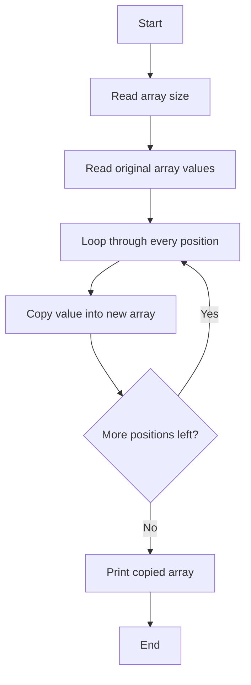

#### 📝 Variable Purpose
- Original array: holds user input values
- New array: stores the copied values
- Size: number of elements
- Index: helps travel through all positions

---

### A_2: Count Negative Elements

#### 💡 Problem
Count how many values in the array are less than zero.

#### 📝 Example Trace
```
Array: 5  -3  8  -9  2  -1
Negative values: -3, -9, -1
Total negative values: 3
```

#### 🧠 Logic Explanation
- Start with a counter equal to zero.
- Check each value one by one.
- If the value is smaller than zero, increase the count.
- After checking all values, print the final count.

#### 📊 Flowchart
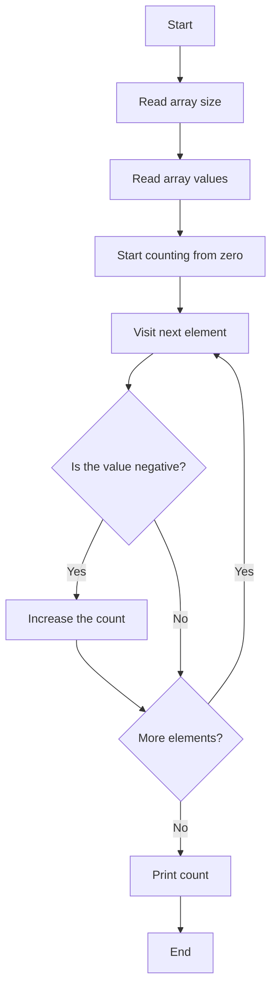

#### 📝 Variable Purpose
- Array: stores the numbers
- Count: stores the total number of negative values
- Index: moves through the array

---

### A_3: Count Numbers Divisible by 3

#### 💡 Problem
Find how many numbers in the array are divisible by three.

#### 📝 Example Trace
```
Array: 9  4  12  7  15  11
Divisible by 3: 9, 12, 15
Total divisible values: 3
```

#### 🧠 Logic Explanation
- Begin with a counter at zero.
- Visit each element in the array.
- Check whether the number leaves no remainder when divided by 3.
- If yes, increase the count.
- At the end, print the final number of divisible values.

#### 📊 Flowchart
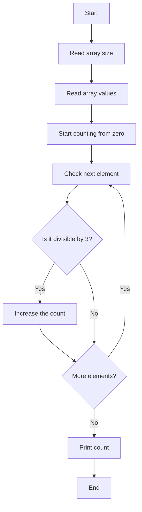

#### 📝 Variable Purpose
- Array: stores the input data
- Count: stores how many values are divisible by 3
- Index: controls traversal

---

### A_4: Search for an Element

#### 💡 Problem
Check whether a given value exists in the array and, if found, show its position.

#### 📝 Example Trace
```
Array: 10  22  18  40  35
Search value: 18
Found at position 2
```

#### 🧠 Logic Explanation
- Read the array and the target value.
- Compare each element with the target value.
- If a match is found, print the position and mark that the value was found.
- If no match is found after checking all elements, print a message saying it is not present.

#### 📊 Flowchart
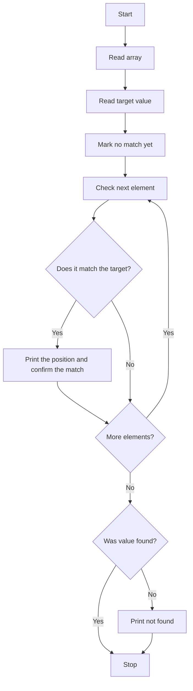

#### 📝 Variable Purpose
- Array: stores input values
- Target value: item to search for
- Found: tells whether a match exists
- Index: moves through each element

---

### A_5: Input a String and Print Length

#### 💡 Problem
Accept a text string from the user and display the string along with its length.

#### 📝 Example Trace
```
Input string: computer
Characters counted: c, o, m, p, u, t, e, r
Length: 8
```

#### 🧠 Logic Explanation
- Read the string.
- Start a length counter at zero.
- Move character by character until the end marker is reached.
- Increase the counter for every character.
- After the end is reached, print the string and the final length.

#### 📊 Flowchart
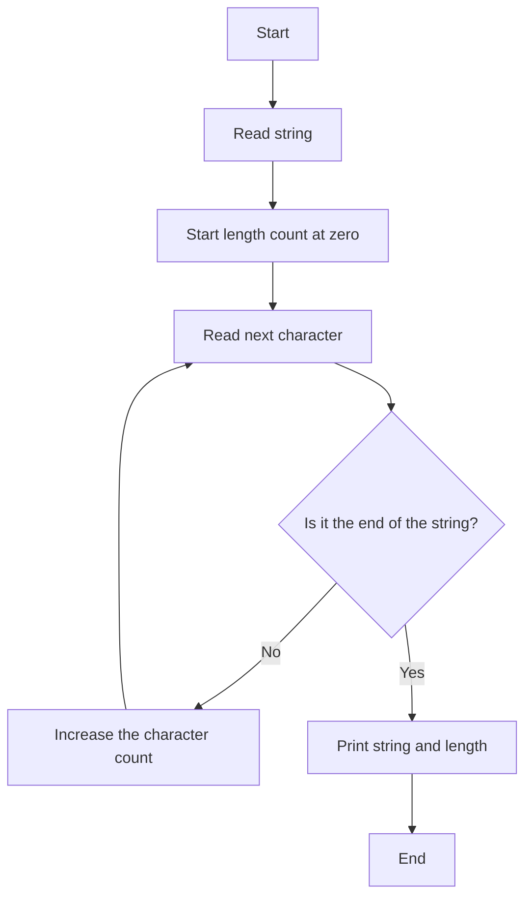

#### 📝 Variable Purpose
- String: stores the user input text
- Length: counts characters
- Index: reads one character at a time

---

## SECTION B: Array Rearrangement and Removal

---

### B_1: Remove Duplicate Elements

#### 💡 Problem
Delete repeated values from the array so that only unique values remain.

#### 📝 Example Trace
```
Array: 5  2  5  8  2  9
After removing duplicates: 5  2  8  9
```

#### 🧠 Logic Explanation
- Take each element as the current value.
- Compare it with all later elements.
- If the same value is found again, shift the remaining values one position left to fill the gap.
- Reduce the effective size of the array.
- Repeat this until all duplicates are removed.
- Print the final unique array.

#### 📊 Flowchart
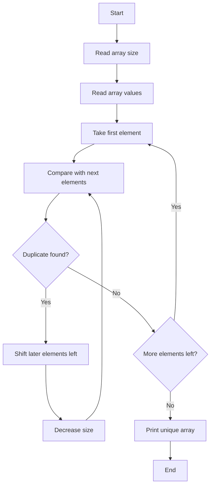

#### 📝 Variable Purpose
- Array: stores original values
- Size: current valid number of elements
- Indexes: compare values and shift data

---

### B_2: Reverse an Array Without Using a Second Array

#### 💡 Problem
Reverse the order of elements using the same array without creating another one.

#### 📝 Example Trace
```
Original array: 10  20  30  40  50
Reversed array: 50  40  30  20  10
```

#### 🧠 Logic Explanation
- Use two positions: one from the beginning and one from the end.
- Swap the first and last elements.
- Then move inward until the middle is reached.
- This reverses the array without needing an additional array.

#### 📊 Flowchart
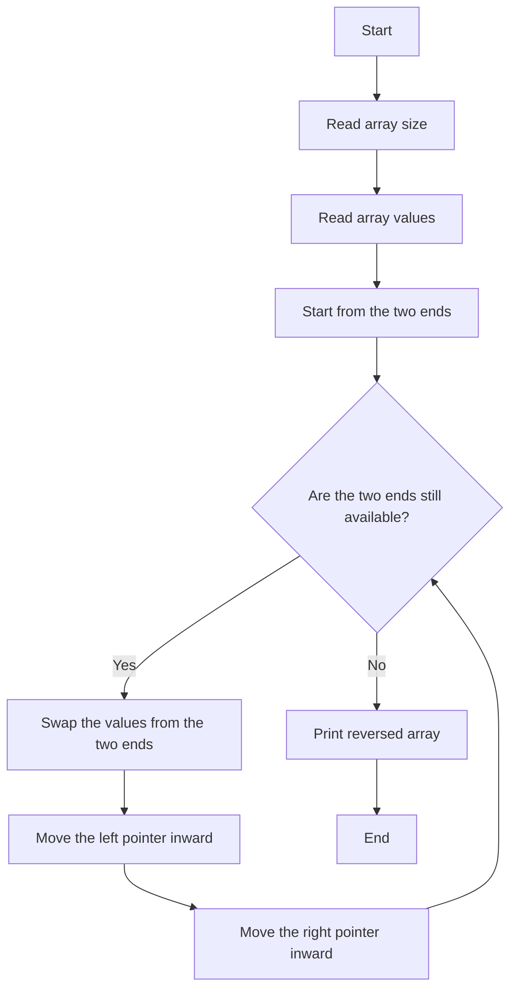

#### 📝 Variable Purpose
- Array: stores the numbers to be reversed
- Left index: starts from the beginning
- Right index: starts from the end
- Temporary value: helps in swapping

---

### B_3: Swap First with Last, Second with Second Last, and So On

#### 💡 Problem
Reverse the array in the pattern of pairwise swapping from both ends.

#### 📝 Example Trace
```
Array: 1  2  3  4  5
After swapping pairs: 5  4  3  2  1
```

#### 🧠 Logic Explanation
- Move through the first half of the array.
- Swap each element with the element opposite it.
- Continue until all pairs are processed.
- The final result is a reversed arrangement.

#### 📊 Flowchart
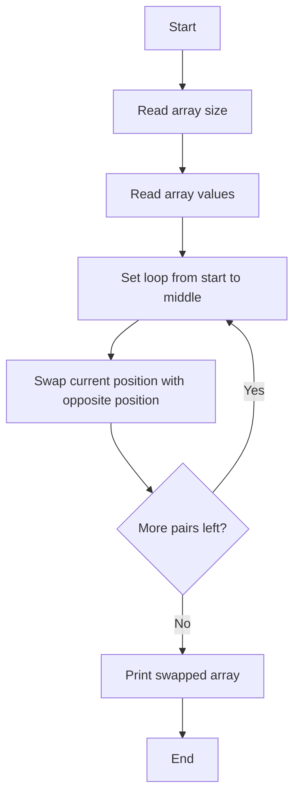

#### 📝 Variable Purpose
- Array: values to be rearranged
- Index: points to current pair
- Temporary value: used to exchange two values

---

## SECTION C: Advanced Array Problems

---

### C_1: Find the Two Largest Elements

#### 💡 Problem
Find the largest and second largest element in the array.

#### 📝 Example Trace
```
Array: 14  9  25  18  30  12
Largest value: 30
Second largest value: 25
```

#### 🧠 Logic Explanation
- Assume the first element is the largest.
- Compare each remaining value with this largest value.
- Update the largest when a bigger value appears.
- After finding the largest, remove or ignore it and repeat the search on the remaining elements.
- The second largest is the maximum among the remaining values.

#### 📊 Flowchart
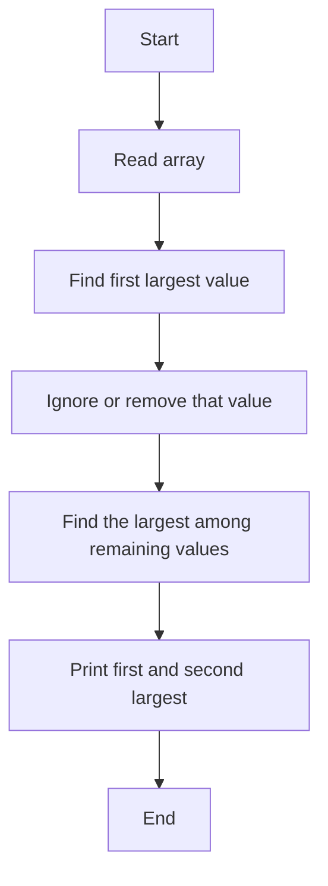

#### 📝 Variable Purpose
- Array: stores input values
- max1: largest value found
- max2: second largest value
- Index: checks all positions

---

### C_2: Insert a New Value at a Chosen Index

#### 💡 Problem
Insert a new value into an array at a specific position while shifting the later elements right to make space.

#### 📝 Example Trace
```
Original array: 10  20  30  40
Insert value 25 at index 2
New array: 10  20  25  30  40
```

#### 🧠 Logic Explanation
- Increase the size of the array to make room for one more value.
- Read the insertion position and the new value.
- Validate the index so it stays within the valid range.
- Move each element after the insertion point one place to the right.
- Place the new value in the empty position.
- Print the updated array.

#### 📊 Flowchart
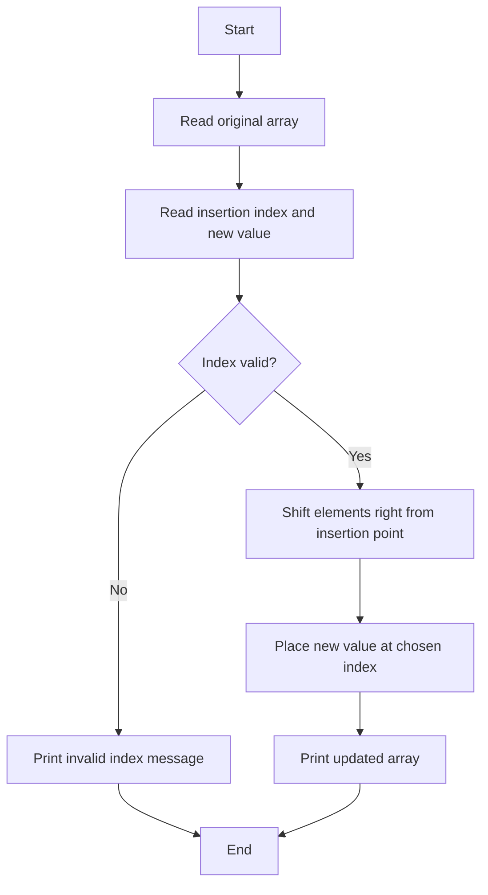

#### 📝 Variable Purpose
- Array: stores original values
- New value: item to insert
- Index: position where insertion happens
- Size: updated total number of elements

---

### C_3: Remove All Occurrences of a Given Value

#### 💡 Problem
Delete every element equal to a chosen value and keep the remaining elements together.

#### 📝 Example Trace
```
Array: 3  5  3  8  3  9
Remove value: 3
Result: 5  8  9
```

#### 🧠 Logic Explanation
- Read the array and the value to remove.
- Visit each position one by one.
- If the current element matches the target value, shift all following elements one position left.
- Reduce the size because one value has been removed.
- Check the same index again because the new element moved into that spot.
- Repeat until all matching values are removed.
- Print the final array.

#### 📊 Flowchart
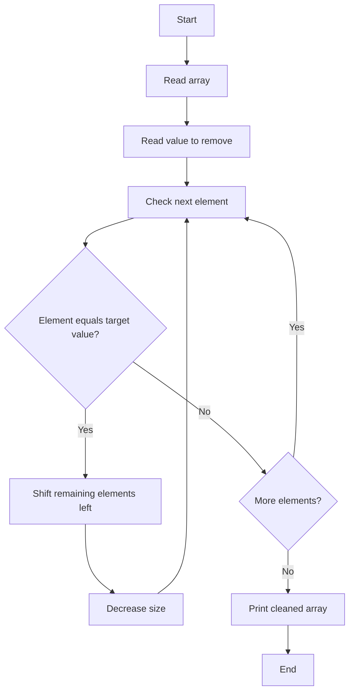

#### 📝 Variable Purpose
- Array: stores input values
- Value to remove: target element
- Size: number of valid elements after deletion
- Indexes: control comparisons and shifting

---

## Final Thoughts

This lab focuses on understanding how array data can be processed efficiently. The main ideas are:

- reading and storing values
- checking conditions for each element
- shifting elements to create space or remove data
- reversing and rearranging values in place
- searching, counting, and comparing values

These operations are important because arrays are widely used in C programming for storing and processing large sets of related data.
