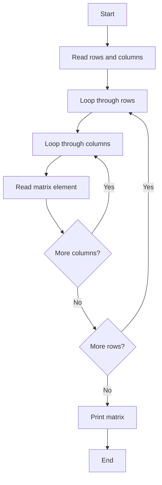
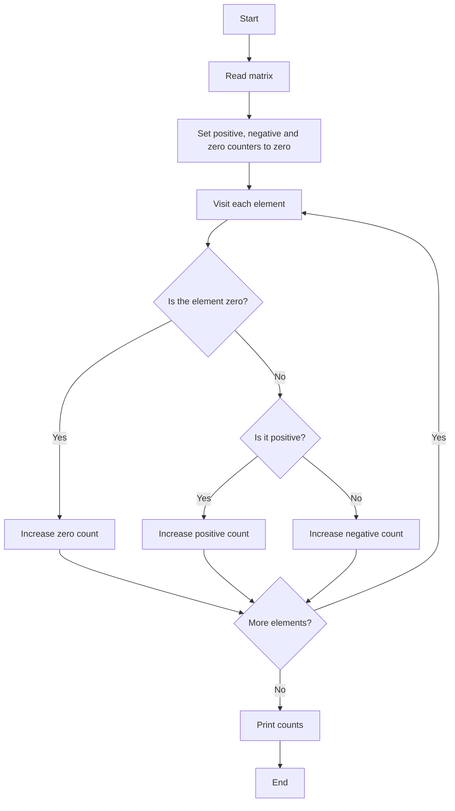
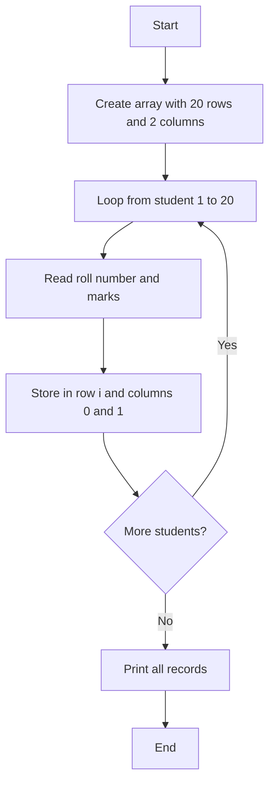
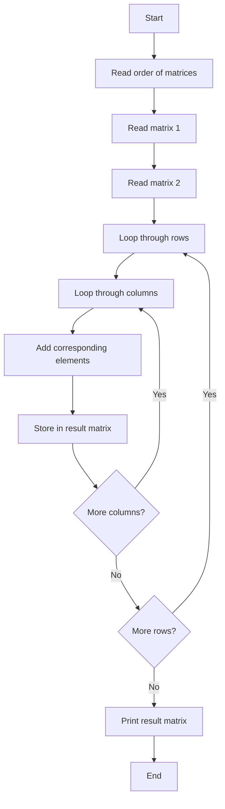
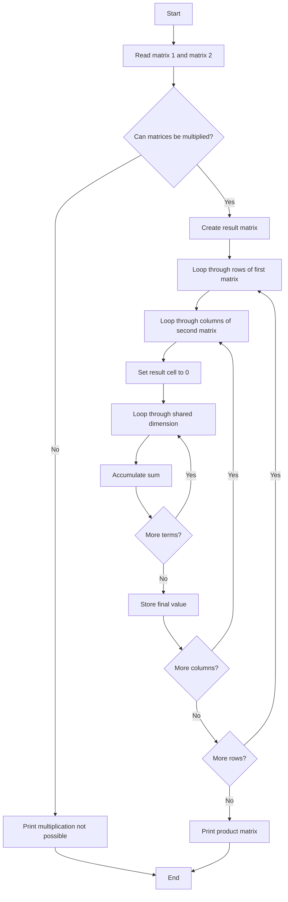
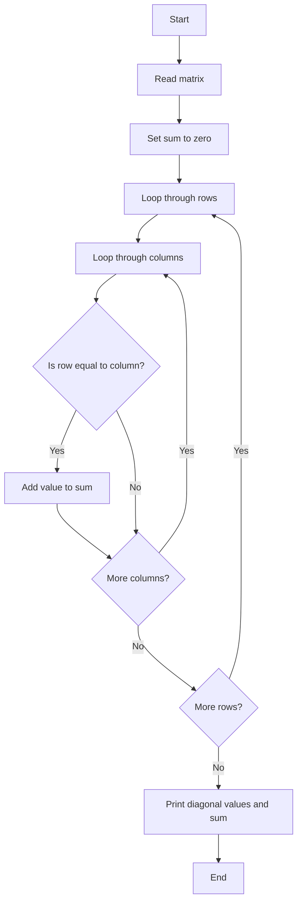
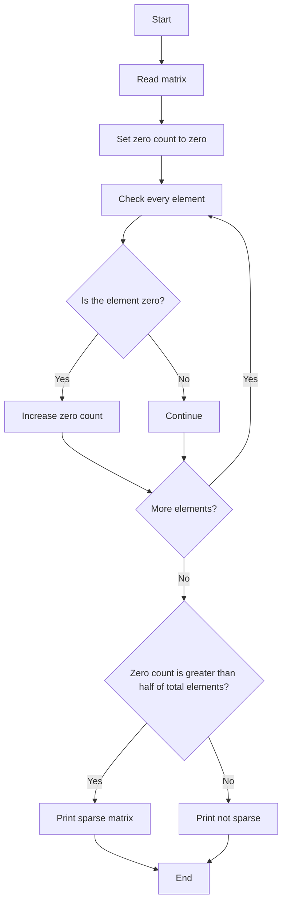
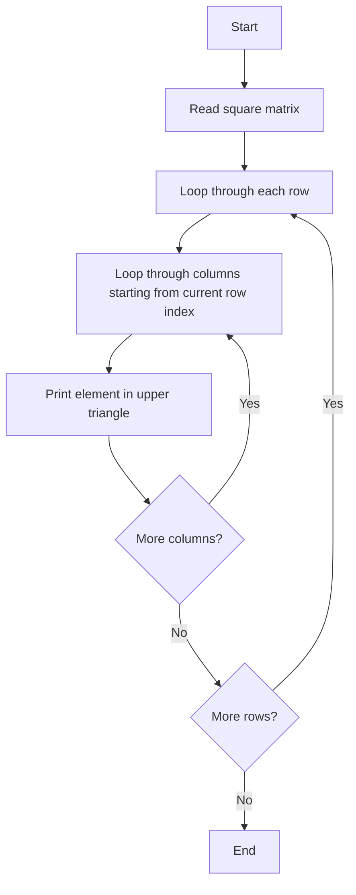

# Lab 16: Two-Dimensional Arrays and Matrix Operations

In this lab, we study two-dimensional arrays, which are used to store data in rows and columns. These arrays are very useful when working with tables, matrices, student records, and many other data structures in C.

---

## What is a 2D Array?

A two-dimensional array is a collection of data arranged in rows and columns. It can be imagined as a table:

- Each row stores a set of values.
- Each column stores values belonging to the same position across different rows.
- The total number of elements is calculated as rows multiplied by columns.

Two-dimensional arrays are commonly used for:
- matrices,
- student records,
- tables of marks,
- board games and grids,
- image processing and scientific calculations.

A 2D array is created by deciding the number of rows and columns first. After that, each element can be accessed using its row index and column index.

---

## Creating and Initialising a 2D Array

To create a 2D array, we first decide:
- how many rows the array should have,
- how many columns it should have,
- what type of data it will store.

After the size is known, the array is allocated, and then values can be entered element by element. A 2D array is usually initialized either:
- by entering values while the program is running, or
- by assigning values in a fixed pattern before processing.

For example, a matrix of size 3 x 3 has 3 rows and 3 columns, so it can store 9 values. When processing a matrix, we normally use two nested loops: one for rows and one for columns.

---

## SECTION A: Basic Matrix Input and Operations

---

### A_1: Read and Print a Matrix

#### 💡 Problem
Read a matrix from the user and display it in the same row-column format.

#### 📝 Example Trace
```
Enter the order of your matrix: 2 3
Enter element for row-0 col-0: 1
Enter element for row-0 col-1: 2
Enter element for row-0 col-2: 3
Enter element for row-1 col-0: 4
Enter element for row-1 col-1: 5
Enter element for row-1 col-2: 6

Matrix is:
1 2 3
4 5 6
```

#### 🧠 Logic Explanation
- Read the number of rows and columns.
- Loop through every row.
- Inside that loop, loop through every column.
- Read each matrix element one by one.
- After all values are entered, traverse the matrix again to print each value in rows and columns.
- Each row is printed on a new line.

#### 📊 Flowchart


#### 📝 Variable Purpose
- rows: number of rows in the matrix
- columns: number of columns in the matrix
- i: row index
- j: column index
- matrix: holds all entered values

---

### A_2: Count Positive, Negative and Zero Elements

#### 💡 Problem
Take a matrix and count how many values are positive, negative, or zero.

#### 📝 Example Trace
```
Matrix:
3  0  -2
4  -5  0
7  -1  9

Positive = 5
Negative = 3
Zero = 2
```

#### 🧠 Logic Explanation
- Read the matrix.
- Initialise three counters to zero.
- Check each element.
- If the value is zero, increase the zero count.
- Else if it is greater than zero, increase the positive count.
- Otherwise, it is negative and the negative count is increased.
- At the end, print the totals.

#### 📊 Flowchart


#### 📝 Variable Purpose
- matrix: stores all values
- countP: total number of positive values
- countN: total number of negative values
- countZ: total number of zero values
- i and j: move across rows and columns

---

### A_3: Store Roll Number and Marks of 20 Students

#### 💡 Problem
Store the roll number and marks of 20 students in a 2D array.

#### 📝 Example Trace
```
Record 1: 101 78
Record 2: 102 88
Record 3: 103 75
...
Record 20: 120 92

Stored successfully.
```

#### 🧠 Logic Explanation
- Create a two-dimensional array with 20 rows and 2 columns.
- Each row represents one student.
- Column 0 stores the roll number.
- Column 1 stores the marks.
- Use a loop to read the data for each student.
- After input, print all records stored in the array.

#### 📊 Flowchart


#### 📝 Variable Purpose
- arr: stores student record data
- i: student number
- arr[i][0]: roll number
- arr[i][1]: marks

---

### A_4: Add Two Matrices

#### 💡 Problem
Add two matrices of the same size and store the result in a third matrix.

#### 📝 Example Trace
```
Matrix 1:
1 2
3 4

Matrix 2:
5 6
7 8

Result:
6 8
10 12
```

#### 🧠 Logic Explanation
- Read the order of the matrices.
- Read both matrices row by row.
- Create a result matrix of the same size.
- For each position, add the corresponding elements from matrix 1 and matrix 2.
- Store the sum in the same row and column position of the result matrix.
- Print the final sum matrix.

#### 📊 Flowchart


#### 📝 Variable Purpose
- matrix1: first matrix
- matrix2: second matrix
- addedMatrix: result matrix
- rows and cols: matrix dimensions
- i and j: row and column positions

---

## SECTION B: Matrix Transformations and Diagonal Operations

---

### B_1: Print the Transpose of a Matrix

#### 💡 Problem
Swap the rows and columns of a matrix to form its transpose.

#### 📝 Example Trace
```
Original matrix:
1 2 3
4 5 6

Transpose matrix:
1 4
2 5
3 6
```

#### 🧠 Logic Explanation
- Read the original matrix.
- Traverse each element using row and column indices.
- In the transpose, the value at row i and column j is placed at row j and column i.
- Print the transformed matrix in its new orientation.
- The transpose of a matrix is only meaningful for rectangular matrices when the row and column positions are swapped.

#### 📊 Flowchart
```mermaid
flowchart TD
    A[Start] --> B[Read matrix]
    B --> C[Loop through rows]
    C --> D[Loop through columns]
    D --> E[Print matrix[j][i]]
    E --> F{More columns?}
    F -->|Yes| D
    F -->|No| G{More rows?}
    G -->|Yes| C
    G -->|No| H[End]
```

#### 📝 Variable Purpose
- matrix: original matrix
- rows and columns: size of original matrix
- i: row index
- j: column index

---

### B_2: Multiply Two Matrices

#### 💡 Problem
Multiply two matrices and store the product if the multiplication condition is satisfied.

#### 📝 Example Trace
```
Matrix 1:
1 2
3 4

Matrix 2:
5 6
7 8

Product matrix:
19 22
43 50
```

#### 🧠 Logic Explanation
- Read the order of both matrices.
- Check whether multiplication is possible: the number of columns in the first matrix must equal the number of rows in the second matrix.
- If possible, create a result matrix.
- For each cell of the product matrix, multiply the corresponding row of the first matrix by the corresponding column of the second matrix.
- Add all these values to get the final product.
- Print the product matrix.

#### 📊 Flowchart


#### 📝 Variable Purpose
- matrix1: first matrix
- matrix2: second matrix
- productMatrix: result matrix
- i: row of matrix1
- j: column of matrix2
- k: shared dimension index

---

### B_3: Print Diagonal Elements and Their Sum

#### 💡 Problem
Read a square matrix and print the diagonal elements and their sum.

#### 📝 Example Trace
```
Matrix:
2 5 1
8 3 6
4 7 9

Diagonal elements: 2, 3, 9
Sum of diagonal elements: 14
```

#### 🧠 Logic Explanation
- Read the matrix.
- Traverse each element.
- If a value is in a position where row index equals column index, it lies on the main diagonal.
- Add such values to a running total.
- Print the diagonal elements and their total.

#### 📊 Flowchart


#### 📝 Variable Purpose
- matrix: input matrix
- sum: store total of diagonal elements
- i: row index
- j: column index

---

## SECTION C: Special Matrix Types

---

### C_1: Check Whether a Matrix is Sparse

#### 💡 Problem
Determine whether a matrix is sparse based on the number of zero entries.

#### 📝 Example Trace
```
Matrix:
0  0  5
0  8  0
7  0  0

Number of zero values: 6
Total elements: 9
Threshold is more than half the elements.
Therefore, the matrix is a sparse matrix.
```

#### 🧠 Logic Explanation
- Read the matrix.
- Count how many elements are zero.
- Calculate the number of total elements in the matrix.
- If the zero count is greater than half of the total elements, the matrix is called sparse.
- Otherwise, it is not sparse.

#### 📊 Flowchart


#### 📝 Variable Purpose
- matrix: input matrix
- count: number of zeros
- rows and columns: matrix size
- i and j: loop variables

---

### C_2: Print the Upper Triangular Matrix

#### 💡 Problem
Display only the upper triangular part of a square matrix. In this part, all values below the main diagonal are ignored.

#### 📝 Example Trace
```
Original matrix:
1 2 3
4 5 6
7 8 9

Upper triangular matrix:
1 2 3
0 5 6
0 0 9
```

#### 🧠 Logic Explanation
- Read a square matrix.
- Use nested loops.
- For each row, print only the elements from the main diagonal to the right side.
- Values below the diagonal are replaced with blanks or ignored.
- The print format highlights the upper triangular structure.

#### 📊 Flowchart


#### 📝 Variable Purpose
- matrix: input square matrix
- size: order of the matrix
- i: row index
- j: column index

---

## Conclusion

This lab introduces the idea of a two-dimensional array and shows how it can be used to solve matrix-related problems. We learned how to:
- create and store values in a 2D array,
- process data row by row and column by column,
- perform matrix operations such as addition, transpose, multiplication, and diagonal processing,
- identify matrix properties like sparsity and upper triangular structure.

Two-dimensional arrays are an important foundation in C programming because they allow us to represent data in a structured, table-like form and solve many real-world problems efficiently.
