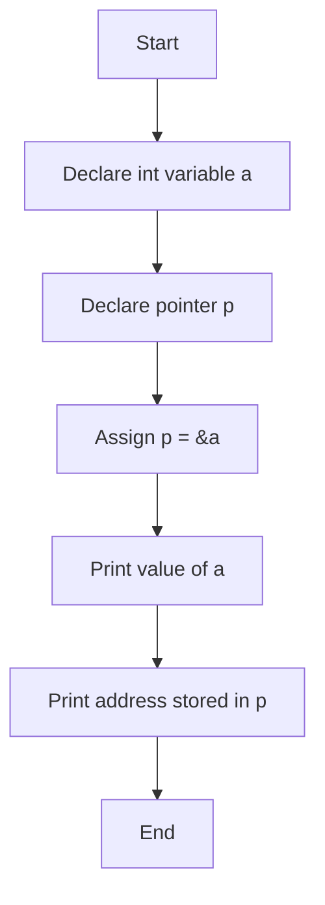
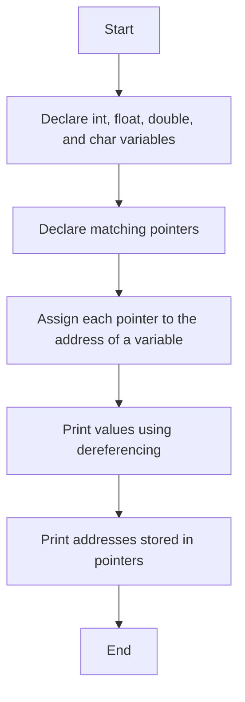
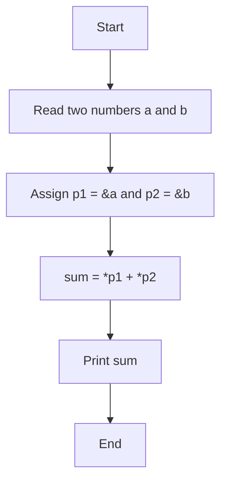
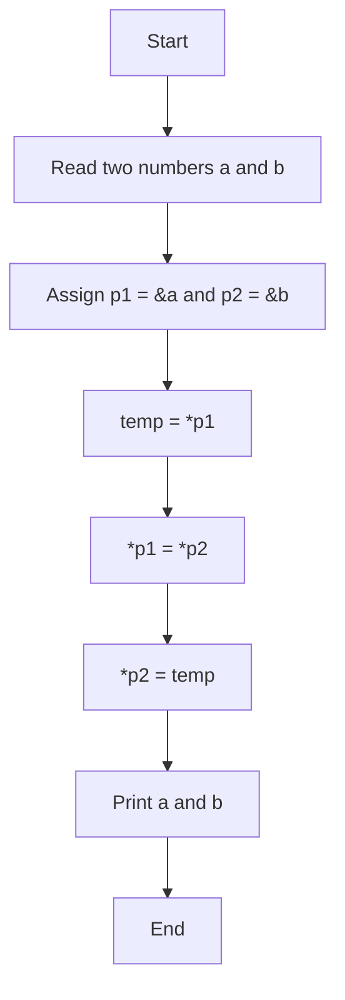
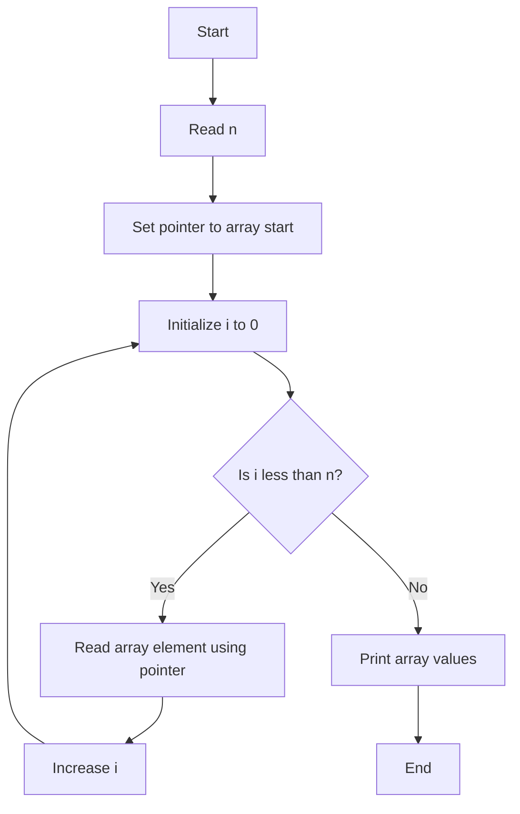
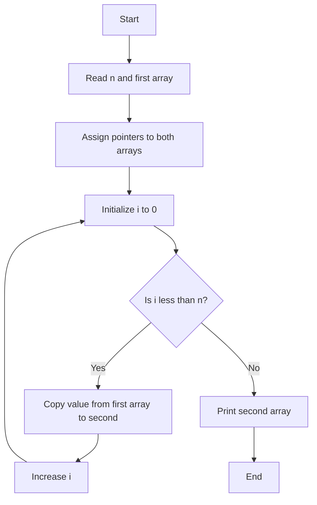
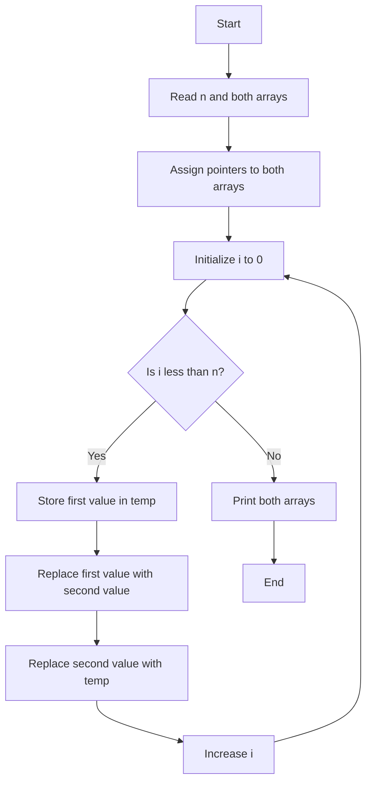
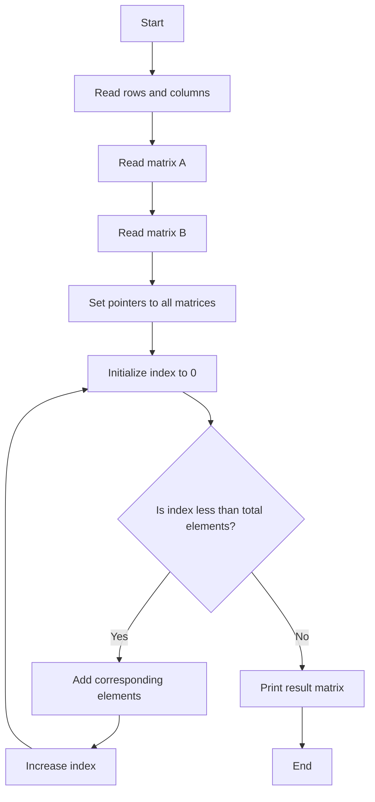
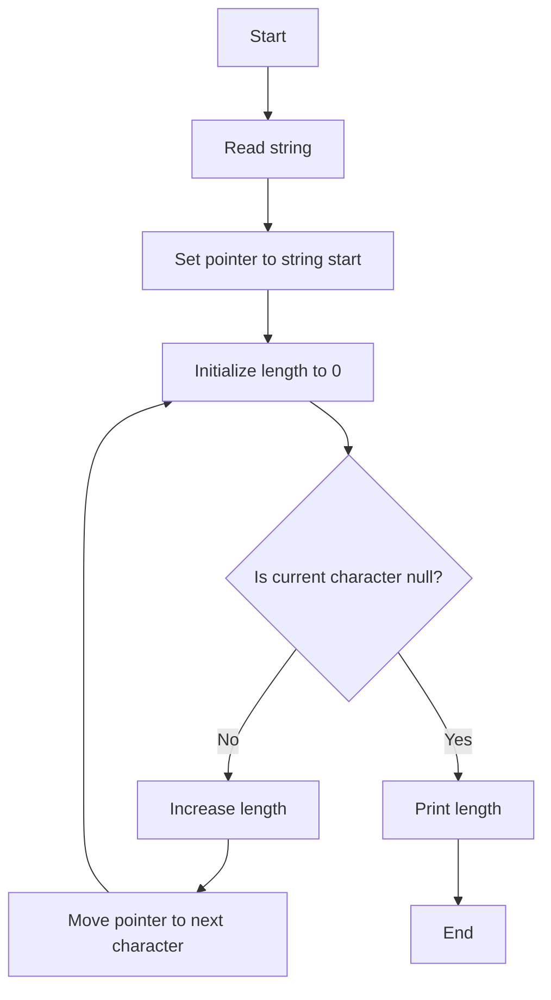
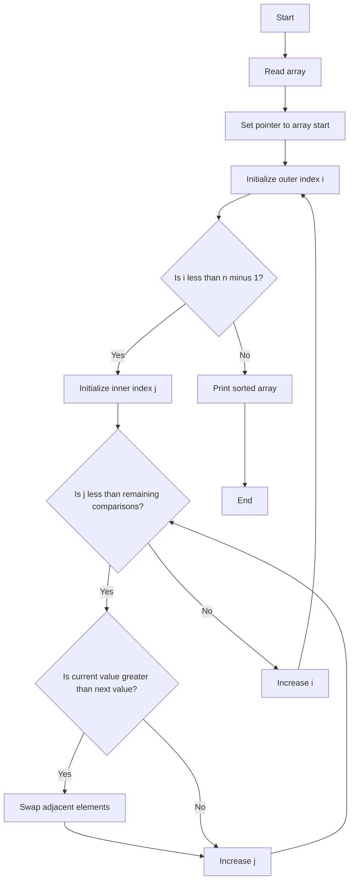

# Lab 17: Pointers in C

In this lab, we study pointers, one of the most important concepts in C programming. Pointers are used to store memory addresses, which makes it possible to work efficiently with arrays, strings, function parameters, dynamic memory, and low-level data handling.

---

## What is a Pointer?

A pointer is a variable that stores the memory address of another variable.

Think of a variable as a box that holds a value, and a pointer as a note that tells us where that box is located in memory.

```c
int a = 10;
int *p = &a;
```

Here:
- a stores the value 10.
- p stores the address of a.
- So p points to the location of a in memory.

This is useful because:
- It helps us access values indirectly.
- It allows us to work with arrays and strings efficiently.
- It supports swapping values without copying large data.
- It helps in dynamic memory allocation and memory optimization.

---

## Creating and Initialising a Pointer

To create a pointer, we must first decide the type of variable whose address it will store.

For example:
- int *p; means p is a pointer to an integer.
- float *f; means f is a pointer to a float.
- char *ch; means ch is a pointer to a character.

To initialize a pointer, we assign it the address of a variable using the address-of operator.

```c
int a = 10;
int *p = &a;
```

Here:
- a is a normal integer variable.
- p stores the address of a.
- The pointer does not contain the value 10 itself; it contains the location where 10 is stored.

The pointer is not yet the value itself; it only points to where the value is stored.

---

## Accessing the Pointer and the Value at That Address

There are different ways to access a pointer and the value it points to.

### 1. Accessing the address stored in the pointer
A pointer can be printed or used to know the memory address it contains.

This is done by using the pointer variable itself.

Example idea:
- p gives the address stored in p.
- If p points to a, then p is the address of a.

Use the `%p` format specifier to print an address. Convert the pointer to `void *` when passing it to `printf`:

```c
int a = 10;
int *p = &a;

printf("Address of a = %p\n", (void *)p);
```

Use `%p` instead of `%d` or `%u` because `%d` expects an `int` and `%u` expects an `unsigned int`; neither format is for a pointer. Passing a pointer to `printf` with an integer format specifier has undefined behavior, and an address is not guaranteed to fit in an integer type. `%p` is the format specifier for pointers.

### 2. Accessing the value stored at the address
To access the value pointed to by a pointer, we use the dereference operator.

```c
int a = 10;
int *p = &a;

printf("%d", *p);   // prints 10
```

Here:
- *p gives the value stored at the address pointed to by p.
- If p points to a, then *p is the same as a.

This means:
- a = 10
- *p = 10

### 3. Accessing values in different ways
There are several common pointer access patterns:

- *p: value at the address pointed by p
- p: address stored in p
- &a: address of variable a
- *(p + i): value at the next position from pointer p
- p[i]: same as *(p + i)

These forms are especially useful for working with arrays.

```c
int arr[5] = {10, 20, 30, 40, 50};
int *p = arr;

printf("%d\n", *p);      // 10
printf("%d\n", p[2]);    // 30
printf("%d\n", *(p+3));  // 40
```

This example shows that the same value can be accessed using direct dereferencing, array-style indexing, or pointer arithmetic.

---

## Pointer Arithmetic

Pointers can be used with arithmetic operations.

For example, if p points to the first element of an array:
- p + 1 points to the next element,
- p + 2 points to the second next element,
- *(p + i) gives the i-th element of the array.

This is why pointers and arrays are closely related in C.

Pointer arithmetic is valid only when the pointer type is known, because the compiler knows the size of the data type it points to.

```c
int arr[5] = {10, 20, 30, 40, 50};
int *p = arr;

printf("%d\n", *(p + 2));   // 30
printf("%d\n", p[3]);       // 40
```

This shows that pointer arithmetic moves the pointer to the next position in the array, according to the pointer type:
- int pointer moves by 4 bytes each step,
- char pointer moves by 1 byte each step,
- float pointer moves by 4 bytes each step.

---

## Pointers and Arrays

An array name is itself a pointer-like identifier.

For an array a:
- a gives the base address of the array,
- a[i] is the same as *(a + i).

This means that:
- the first element can be accessed as a[0],
- the second element as a[1],
- and the pointer expression *(p + 1) can also be used.

```c
int arr[4] = {5, 10, 15, 20};
int *p = arr;

printf("%d\n", arr[2]);    // 15
printf("%d\n", *(p + 2)); // 15
```

Arrays and pointers are often used together in C, especially while scanning, copying, sorting, and processing collections of values.

---

## Pointers to Different Data Types

A pointer must match the type of the variable it points to.

Examples:
- int *p1 points to an integer
- float *p2 points to a float
- double *p3 points to a double
- char *p4 points to a character

```c
int a = 10;
float b = 20.5;
char c = 'A';

int *p1 = &a;
float *p2 = &b;
char *p3 = &c;
```

Using the correct pointer type is important because the compiler uses the type to calculate memory access correctly.

---

## Null Pointers

A null pointer is a pointer that does not point to any valid memory location.

This is useful for checking when a pointer is not initialized or unable to access memory.

```c
int *p = NULL;

if (p == NULL)
{
    printf("Pointer is not assigned to any valid address.\n");
}
```

Example idea:
- A pointer may be assigned NULL before being used.
- Before dereferencing a pointer, programmers should ensure the pointer is valid.

---

## Pointer to Pointer

A pointer can also store the address of another pointer.

This is called a pointer-to-pointer.

```c
int a = 10;
int *p = &a;
int **q = &p;
```

Here:
- p stores the address of a,
- q stores the address of p.

This is called a pointer-to-pointer and is useful in advanced C programming.

This concept is useful in advanced C programs, especially in dynamic memory and function parameter passing.

---

## Passing Pointers to Functions

Pointers are often passed to functions so the function can modify the original values instead of working on copies.

This is useful for:
- swapping numbers,
- modifying array values,
- updating structure data,
- efficient processing without copying large blocks of memory.

```c
void swap(int *x, int *y)
{
    int temp = *x;
    *x = *y;
    *y = temp;
}
```

A function parameter can be declared as a pointer, and the function can dereference it to change the original data.

---

## Some Important Pointer Rules

- A pointer must be initialized before use.
- Always use the correct data type matching the variable's type.
- Do not dereference an uninitialized pointer.
- Be careful with pointer arithmetic.
- Pointers are powerful but can cause bugs if used incorrectly.
- Memory must be managed carefully, especially when allocating memory dynamically.

---

## Why Pointers are Important

Pointers are essential because they let us:
- access memory directly,
- work with arrays and strings effectively,
- pass data to functions efficiently,
- perform data transformation in place,
- manage dynamic memory and complex structures.

Without pointers, C would be much less flexible and far less efficient for many real-world tasks.

---

## SECTION A: Basic Pointer and Array Programs


---

### A_1: Print Value and Address of a Variable

#### 💡 Problem
Create a variable, store its address in a pointer, and display both the value and the memory address.

#### 📝 Example Trace
```
Value of a = 10
Address of a = 0x....
```

#### 🧠 Logic Explanation
- Declare an integer variable.
- Declare a pointer to integer.
- Store the address of the variable into the pointer.
- Print the value of the variable directly.
- Print the address using the pointer.
- This shows that a pointer stores the location of the value in memory.

#### 📊 Flowchart


#### 📝 Variable Purpose
- a: integer variable whose address is stored
- p: pointer that stores the address of a

---

### A_2: Demonstrate Integer, Float, Double and Character Pointers

#### 💡 Problem
Use pointers of different data types to store addresses of variables and print their values and addresses.

#### 📝 Example Trace
```
Integer value = 10
Float value = 20.500000
Double value = 30.550000
Character value = A

Addresses:
Address of a = 0x....
Address of b = 0x....
Address of c = 0x....
Address of d = 0x....
```

#### 🧠 Logic Explanation
- Declare variables of types int, float, double, and char.
- Declare matching pointer variables for each type.
- Assign each pointer to the corresponding variable address.
- Access values using dereferencing.
- Print both the values and their addresses.
- This demonstrates that pointer type and variable type must match.

#### 📊 Flowchart


#### 📝 Variable Purpose
- a, b, c, d: variables of different data types
- p1, p2, p3, p4: pointers corresponding to each variable type

---

### A_3: Calculate Sum of Two Numbers Using Pointers

#### 💡 Problem
Read two numbers, store their addresses in pointers, and compute the sum using dereferencing.

#### 📝 Example Trace
```
Enter two numbers: 12 18
Sum = 30
```

#### 🧠 Logic Explanation
- Read two integer values from the user.
- Create two integer pointers.
- Assign each pointer to the address of one number.
- Use dereference operation to read the values.
- Add them and store the result.
- Print the sum.

#### 📊 Flowchart


#### 📝 Variable Purpose
- a, b: input numbers
- sum: result of addition
- p1, p2: pointers to a and b

---

### A_4: Swap Values of Two Numbers Using Pointers

#### 💡 Problem
Swap the contents of two variables without using normal value assignment alone, using pointer references.

#### 📝 Example Trace
```
Enter two numbers: 10 20
After swapping:
a = 20
b = 10
```

#### 🧠 Logic Explanation
- Read two integers.
- Store their addresses in pointers.
- Use a temporary variable to hold one value.
- Transfer the value from the first variable to the second through dereferencing.
- Transfer the saved value back to the first variable.
- Print the final values.

#### 📊 Flowchart


#### 📝 Variable Purpose
- a, b: original values
- temp: temporary storage while swapping
- p1, p2: pointers to a and b

---

### A_5: Read and Print Array Elements Using Pointers

#### 💡 Problem
Store a list of numbers in an array and access it using pointer arithmetic.

#### 📝 Example Trace
```
Enter number of elements: 5
Enter elements:
10 20 30 40 50
Array elements are:
10 20 30 40 50
```

#### 🧠 Logic Explanation
- Declare an integer array and a pointer.
- Read the number of elements.
- Point the pointer to the beginning of the array.
- Use a loop to read values using pointer-based indexing.
- Use another loop to print values using pointer operations.
- This shows that arrays can be traversed using pointer arithmetic.

#### 📊 Flowchart


#### 📝 Variable Purpose
- a: array to store values
- n: number of elements
- i: loop counter
- p: pointer to array base address

---

## SECTION B: Array Copying, Swapping, and Matrix Addition Using Pointers

---

### B_1: Copy Elements of One Array into Another Using Pointers

#### 💡 Problem
Create a second array and copy all elements from the first array by using pointer-based assignments.

#### 📝 Example Trace
```
Enter number of elements: 4
Enter elements of first array:
1 2 3 4
Second array is:
1 2 3 4
```

#### 🧠 Logic Explanation
- Read the first array.
- Set pointer p1 to the first array and pointer p2 to the second array.
- Use a loop to copy each element from the first array to the second.
- The value expression *(p1 + i) is copied into *(p2 + i).
- Print the copied array.

#### 📊 Flowchart


#### 📝 Variable Purpose
- a: first array
- b: destination array
- p1: pointer to first array
- p2: pointer to second array
- i: loop counter

---

### B_2: Swap Two Arrays Using Pointers

#### 💡 Problem
Exchange the elements of two arrays without creating a third array for the whole data set.

#### 📝 Example Trace
```
Enter number of elements: 3
Enter elements of first array:
10 20 30
Enter elements of second array:
40 50 60
First array after swapping:
40 50 60
Second array after swapping:
10 20 30
```

#### 🧠 Logic Explanation
- Read both arrays.
- Assign pointers to the starting positions of both arrays.
- Loop through each index.
- Swap the values at the same index position using a temporary variable.
- Print both arrays after swapping.

#### 📊 Flowchart


#### 📝 Variable Purpose
- a, b: arrays to swap
- p1, p2: pointers to arrays
- temp: intermediate storage for swapping
- i: loop counter

---

### B_3: Add Two Matrices Using Pointers

#### 💡 Problem
Add two matrices using pointer-based access instead of using normal index access throughout the computation.

#### 📝 Example Trace
```
Enter the order of the matrices: 3 3
Enter elements of first matrix:
1 2 3
4 5 6
7 8 9

Enter elements of second matrix:
9 8 7
6 5 4
3 2 1

Sum of matrices:
10 10 10
10 10 10
10 10 10
```

#### 🧠 Logic Explanation
- Read the sizes of the matrices.
- Read both matrices.
- Set three pointers to the starting addresses of the two input matrices and the result matrix.
- Since matrices are stored in row-major order in memory, each value can be accessed by pointer offset.
- Add corresponding elements and store the result in the third matrix.
- Print the result matrix.

#### 📊 Flowchart


#### 📝 Variable Purpose
- a, b: input matrices
- c: result matrix
- p1, p2, p3: pointers to each matrix
- i, j: loop counters

---

## SECTION C: String and Sorting Operations with Pointers

---

### C_1: Find the Length of a String Using Pointers

#### 💡 Problem
Count the number of characters in a string without using indexing.

#### 📝 Example Trace
```
Enter a string: Hello
Length of string = 5
```

#### 🧠 Logic Explanation
- Read a string from the user.
- Assign a char pointer to the start of the string.
- Move the pointer forward until it reaches the null character '\0'.
- Count how many times the pointer is advanced.
- Print the length.

#### 📊 Flowchart


#### 📝 Variable Purpose
- str: input string
- p: pointer to string characters
- length: total number of characters

---

### C_2: Sort an Array Using Pointers

#### 💡 Problem
Arrange the elements of an array in ascending order using pointer-based comparisons and swapping.

#### 📝 Example Trace
```
Enter number of elements: 5
Enter elements:
9 4 1 7 3
Array after sorting:
1 3 4 7 9
```

#### 🧠 Logic Explanation
- Read the array elements.
- Assign a pointer to the first element.
- Use nested loops to compare adjacent elements.
- If the first element is greater than the second, swap them.
- Repeat the process until the array becomes sorted.
- Print the sorted array.

#### 📊 Flowchart


#### 📝 Variable Purpose
- a: array to sort
- p: pointer to array
- n: number of elements
- i, j: loop counters
- temp: temporary variable for swapping

---

## Summary of Lab 17

This lab teaches the core idea of pointers in C:
- a pointer stores an address,
- dereferencing gives the actual value,
- pointer arithmetic can traverse arrays,
- pointers can be used to copy, compare, swap, and sort data efficiently,
- pointers are used heavily in strings, arrays, and memory-based operations.

By the end of this lab, students should be able to:
- declare and initialize pointers correctly,
- access values using both pointer and array notation,
- understand how pointers relate to memory locations,
- manipulate arrays and strings using pointer operations,
- successfully write pointer-based programs with clear logic and correct flow.

---

## Important Final Note

Pointers are very useful, but they must be used carefully. A wrong pointer assignment or an invalid memory access can cause logic errors or crashes. This is why understanding address values, dereferencing, and pointer arithmetic is essential in C programming.

This lab gives the foundation for more advanced topics such as:
- dynamic memory allocation,
- linked lists,
- strings and character arrays,
- structures and file handling,
- function arguments by reference.
