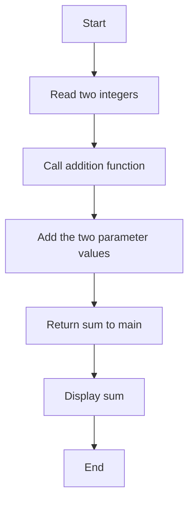
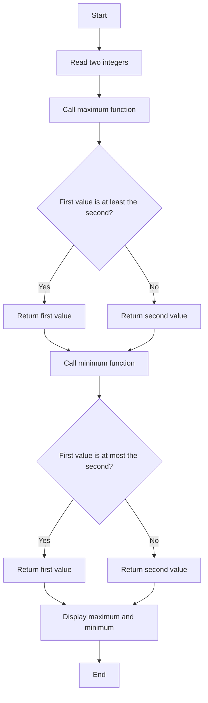
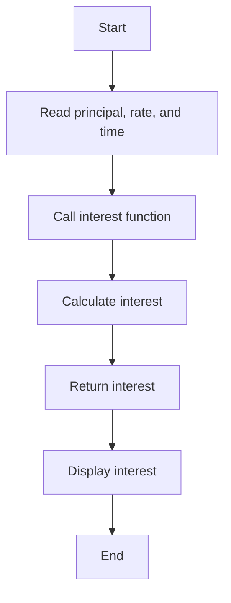
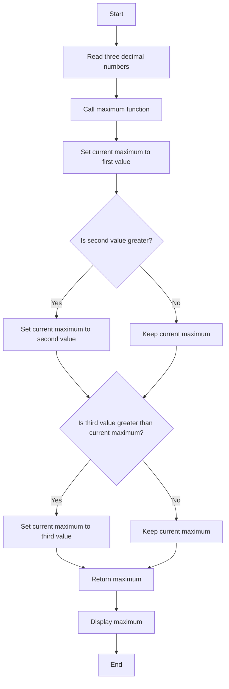
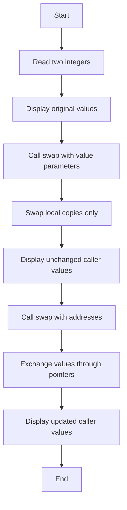
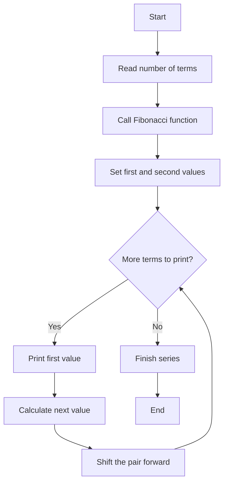
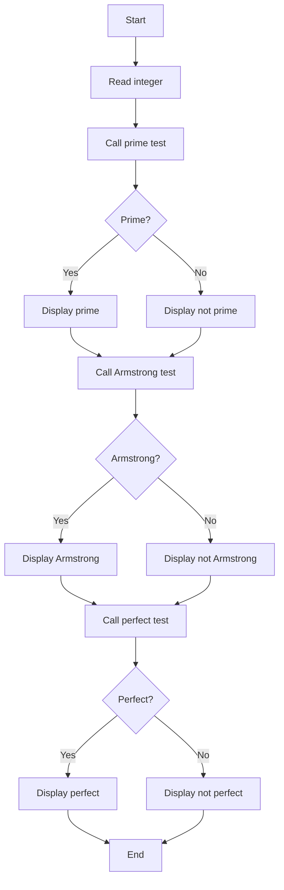
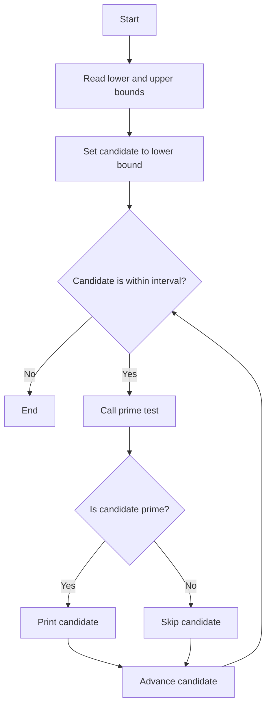
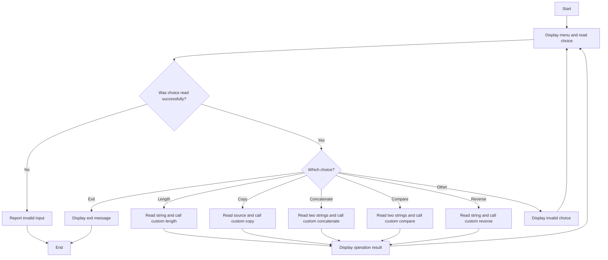
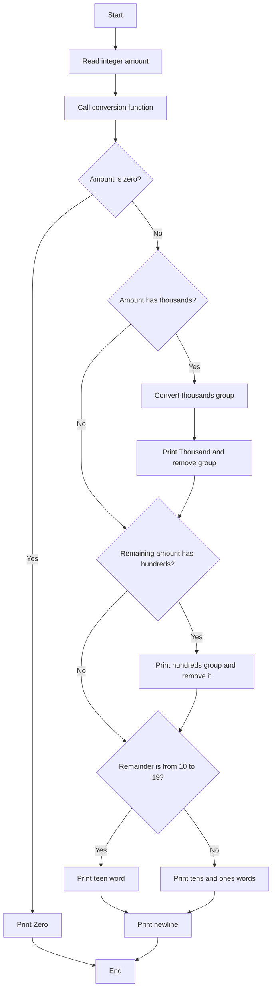

# Lab 18: Functions in C

This lab uses functions for calculations, number checks, series, swapping, and string operations.

This guide keeps all programs required by the lab manual. Explanations are limited to the concepts students need to complete those programs.

---

## What Is a Function?

- A function is a named set of instructions that does a specific task.
- Functions organize work into named, reusable units.
- A function can receive input, perform a task, and optionally return a result.
- A C program starts running from `main`, which can call other functions to perform their tasks.

Using functions helps to give tasks clear names, reuse instructions, divide large problems into smaller parts, and make programs easier to check and update.

| Part | What it means |
| --- | --- |
| Name | How the function is called |
| Return type | The kind of answer it gives back, if any |
| Parameters | Optional inputs for the function |
| Body | The instructions that do the task |

## Declaration, Definition, and Call

Using a function has three steps:

1. **Declaration (prototype):** tells C the function's name, inputs, and result type. It ends with a semicolon and has no instructions in it.
2. **Definition:** contains the instructions that do the task.
3. **Call:** runs the function. The values sent to it are called **arguments** and are given to the function's parameters. When it finishes, the program continues after the call.

A function that gives back an answer uses `return`.

```c
int add(int left, int right);       /* declaration / prototype */

int add(int left, int right)        /* definition */
{
    return left + right;
}

int total = add(4, 7);              /* inside main, call: 4 and 7 are arguments */
```

The arguments in a call must match the function's expected parameters and their order.

## Return Values and Function Types

- The return type appears before the function name.
- Use `void` when a function does not give back a result. `return` gives back a result and ends that function call.

Group functions by two questions: 
    - does it take input ?
    - does it give back an answer?

| Function kind | Input values | Result given back | Typical purpose |
| --- | --- | --- | --- |
| No parameters, no return value | None | None (`void`) | Perform an action that needs no supplied data |
| Parameters, no return value | One or more | None (`void`) | Use supplied data to print, update through pointers, or perform another action |
| No parameters, returns a value | None | One value | Produce a result without receiving arguments |
| Parameters and returns a value | One or more | One value | Calculate a result from supplied data |

## How Functions Are Provided

| Kind | Where it comes from | Examples |
| --- | --- | --- |
| **Library function** | Ready-made; its instructions are described in a header such as `<stdio.h>` or `<string.h>` | `printf`, `scanf`, `strlen` |
| **User-defined function** | Written by the programmer for the task | `Add`, `is_prime`, `mystrlen`, `convertToWords` |

User-defined functions can be in the same file as `main` or grouped into a library of their own.

## Arguments: Value and Reference-Like Updates

1. **By value:**
   - C gives the function a copy of the input. Changing that copy does not change the caller's number.

```c
void set_to_zero(int value)
{
    value = 0; /* changes only the local copy */
}
```

1. **Using a pointer:**
   - Give the function the variable's address when it needs to change the caller's number.
   - The function gets a copy of the address, but it still points to the caller's number. 
   - It can use `*` with the pointer to change that number. 
   - C does not have a separate "pass by reference" feature; this pointer method is often called that in class.

```c
void set_to_zero(int *value)
{
    *value = 0; /* changes the caller's integer */
}

int number = 8;
set_to_zero(&number);
```

| Call style | What the function gets | Can it change the caller's number? |
| --- | --- | --- |
| `function(number)` | A copy of the number | No |
| `function(&number)` | The number's address | Yes, using the pointer |

The value-based swap changes only local copies; its pointer-based swap changes the original variables. The address must be valid before a function uses it.

## Arrays, Pointers, and Strings as Function Parameters

- When an array is given to a function, C does not copy the whole array. 
- The function gets a way to access its first item. 
- These two declarations mean the same thing for an integer array:

```c
int sum_values(int values[], int count); // passing array by call
int sum_values(int *values, int count); // passing array by reference
```

The function can access the first item, but does not know how many items are in the array. Pass the number of items(size) separately.

```c
int sum_values(int values[], int count)
{
    int sum = 0;
    for (int i = 0; i < count; i++)
    {
        sum += values[i];
    }
    return sum;
}
```

- Use a regular pointer or array input when the function needs to change items; those changes also affect the caller's array.

- A string parameter can use `char *` to give the function access to its characters. Leave enough room in the destination array when copying or joining text; a pointer does not tell the function how much room is available.

## Scope

**Scope** means the region of the program where a variable can be accessed.

A local variable declared inside a function can normally be used only inside that function.

Use local variables and function inputs for a task's data.

Declare a function before calling it if its instructions appear later in the file.

## Making a Small User-Defined Library

A custom library groups related user-defined functions so they can be reused.

For this lab:

1. Put the function declarations in a `.h` header file.
2. Include the header in the program that uses those functions.
3. Define/use the functions as required by the lab.

For example, `custom_math_library.h` can contain declarations such as `int is_prime(int number);`.

### Header Guards

Header guards help prevent the same header from being included more than once.

A typical guard looks like this:

```c
#ifndef CUSTOM_LIBRARY_H
#define CUSTOM_LIBRARY_H

/* Public function declarations go here. */

#endif
```

## String Functions in C

| Function | What it does |
| --- | --- |
| `strlen` | Counts characters before `\0` |
| `strcpy` | Copies text |
| `strcat` | Joins text |
| `strcmp` | Compares text |
| `strrev`  | Reverses string |

These functions are provided by `<string.h>` and expect text ending in `\0`. The destination array needs enough room for the result and its ending `\0`.

Program C_1 makes similar functions without using the library's string functions; it counts, copies, joins, compares, and reverses characters with loops.

---

## SECTION A: Basic Function Calls and Parameters

### A_1: Add Two Numbers Using a Function

#### 💡 Problem
Read two integers, pass them to a function, and display their sum.

#### 📝 Example Trace
```text
Enter 2 numbers: 4 7
4 + 7 = 11
```

#### 🧠 Logic Explanation
1. Read the two numbers in `main`.
2. Call the addition function with both numbers.
3. The function adds them and gives back the answer.
4. Display the answer.

#### 📊 Flowchart


#### 📝 Variable Purpose
| Name | Purpose |
| --- | --- |
| `num1`, `num2` | Numbers given to the function |
| `sum` | Holds the answer |

### A_2: Find Maximum and Minimum of Two Numbers

#### 💡 Problem
Use separate functions to determine the larger and smaller of two input integers.

#### 📝 Example Trace
```text
Enter 2 numbers: 12 5
Maximum of 12 and 5 is 12
Minimum of 12 and 5 is 5
```

#### 🧠 Logic Explanation
1. Read two numbers.
2. Call the maximum function to get the larger one.
3. Call the minimum function to get the smaller one.
4. Display both answers. If the numbers are equal, both functions return that number.

#### 📊 Flowchart


#### 📝 Variable Purpose
| Name | Purpose |
| --- | --- |
| `num1`, `num2` | The two input numbers |
| `maximum`, `minimum` | Hold the answers from the functions |

### A_3: Calculate Simple Interest

#### 💡 Problem
Calculate simple interest from a principal amount, rate, and time in years.

#### 📝 Example Trace
```text
Enter principal, rate and time (in years): 1000 5 2
Simple Interest for principal 1000.00 at rate 5.00 for time 2 is 100.00
```

#### 🧠 Logic Explanation
1. Read the principal, rate, and time in years.
2. Give these values to the interest function.
3. The function works out the interest and gives back the answer.
4. Display the interest to two decimal places.

#### 📊 Flowchart


#### 📝 Variable Purpose
| Name | Purpose |
| --- | --- |
| `principal`, `rate` | Values used to find the interest |
| `time` | Number of years |
| `interest` | Holds the answer |

### A_4: Return the Greatest of Three Decimal Numbers

#### 💡 Problem
Read three decimal numbers and have a function return the greatest one.

#### 📝 Example Trace
```text
Enter 3 numbers: 9.1 4.5 8.2
Maximum of 9.10, 4.50 and 8.20 is 9.10
```

#### 🧠 Logic Explanation
1. Read three numbers and give them to the maximum function.
2. Start with the first number as the largest.
3. Compare the other numbers one at a time, keeping the largest seen so far.
4. Give back and display the largest number.

#### 📊 Flowchart


#### 📝 Variable Purpose
| Name | Purpose |
| --- | --- |
| `num1`, `num2`, `num3` | The three input numbers |
| `maximum` | Keeps the largest number found |

> **Implementation note:** In `A_4.c`, the third number is checked only if the second is not greater than the first. This can miss the actual greatest number. Compare each number in turn, as shown in the flowchart.

### A_5: Swap Using Value and Pointer Parameters

#### 💡 Problem
Compare swapping local parameter copies with swapping the caller's integers through pointers.

#### 📝 Example Trace
```text
Enter 2 numbers: 3 8
Before swapping: num1 = 3, num2 = 8
After swapping by value: num1 = 3, num2 = 8
After swapping by reference: num1 = 8, num2 = 3
```

#### 🧠 Logic Explanation
1. Read and display the two numbers.
2. Call the value-based function. It swaps its own copies, so the numbers in `main` stay the same.
3. Give the pointer-based function the numbers' addresses. It swaps the original numbers.
4. Display the numbers after each call to show the difference.

#### 📊 Flowchart

#### 📝 Variable Purpose
| Name | Purpose |
| --- | --- |
| `num1`, `num2` | The original numbers in `main` |
| `a`, `b` | Values or addresses received by the swap functions |
| `temp` | Holds a number briefly while swapping |

---

## SECTION B: Reusable Logic and Classification

### B_1: Generate a Fibonacci Series

#### 💡 Problem
Generate and print the first requested number of Fibonacci terms using a loop.

#### 📝 Example Trace
```text
Enter the number of terms for Fibonacci series: 6
Fibonacci series of 6 terms: 0 1 1 2 3 5
```

#### 🧠 Logic Explanation
1. Read how many terms to print and call the series function.
2. Start with zero and one.
3. For each term, print the current number, add the pair to get the next number, then move to the next pair.
4. Stop after printing the requested number of terms.

#### 📊 Flowchart


#### 📝 Variable Purpose
| Name | Purpose |
| --- | --- |
| `n` | Number of terms requested |
| `first`, `second` | Current pair of Fibonacci numbers |
| `next` | Next number in the series |
| `i` | Counts the terms printed |

### B_2: Check Prime, Armstrong, and Perfect Properties

#### 💡 Problem
Use functions from the custom math header to independently test an input integer for three number properties.

#### 📝 Example Trace
```text
Enter a number: 153
153 is not a prime number.
153 is an Armstrong number.
153 is not a perfect number.
```

#### 🧠 Logic Explanation
1. Read one number.
2. Check whether it is prime and display the result.
3. Check whether it is an Armstrong number: count its digits, raise each digit to that count, and add the results.
    For example, 153 has three digits, and $1^3 + 5^3 + 3^3 = 153$.
4. Check whether it is a perfect number by adding its factors, except the number itself, and comparing the sum with the number.
5. Display each result separately. A number may pass more than one test.

#### 📊 Flowchart


#### 📝 Variable Purpose
| Name | Purpose |
| --- | --- |
| `num` | Number being checked |
| `originalNum`, `sum`, `digits`, `digit`, `power` | Values used during the Armstrong check |
| `i` | Counts steps in the helper functions |

### B_3: Print Prime Numbers in an Interval

#### 💡 Problem
Read two end numbers and print every prime number between them, including the ends.

#### 📝 Example Trace
```text
Enter lower and upper interval: 10 20
Prime numbers between 10 and 20 are: 11 13 17 19
```

#### 🧠 Logic Explanation
1. Read the start and end numbers.
2. Check each number between them. Numbers below two are not prime.
3. For each number, call the prime-checking function.
4. Print each number that is prime.

#### 📊 Flowchart


---

#### 📝 Variable Purpose
| Name | Purpose |
| --- | --- |
| `lower`, `upper` | Start and end numbers |
| `num` | Number currently being checked |
| `i` | Possible divisor being checked |

## SECTION C: Custom Libraries and Function Decomposition

### C_1: Implement Custom String Operations

#### 💡 Problem
Provide a repeating menu for finding string length, copying, concatenating, comparing, and reversing strings without using the standard string functions.

#### 📝 Example Trace
```text
1. Find String Length
2. Copy String
3. Concatenate Strings
4. Compare Strings
5. Reverse String
6. Exit
Enter your choice (1-6): 1
Enter a string: hello
Length of the string: 5
```

#### 🧠 Logic Explanation
1. Display the menu and read a choice. If reading fails, show an error and stop.
2. Read the needed text and call the matching function.
3. Length counts characters before `\0`, which marks the end of text.
4. Copy and join move characters into the result and add `\0` at the end.
5. Compare checks characters until it finds a difference or reaches the end.
6. Reverse swaps characters from the two ends inward.
7. Display the result and show the menu again. The exit choice ends the program; an unknown choice shows an error and returns to the menu.

#### 📊 Flowchart


#### 📝 Variable Purpose
| Name | Purpose |
| --- | --- |
| `str1`, `str2` | Text used by the selected operation |
| `dest` | Holds copied text |
| `choice` | Menu option selected |
| `result` | Result of comparing two strings |

> **Input-safety note:** Each text array holds 100 characters, including the ending `\0`, so it can store up to 99 typed characters. The program does not limit input length; very long text can run past the end of an array. Leave room for `\0`.

### C_2: Convert an Integer Amount to Words

#### 💡 Problem
Convert a non-negative integer amount into English words using helper functions for ones, teens, and tens.

#### 📝 Example Trace
```text
Enter an amount: 9241
Amount in words: Nine Thousand Two Hundred Forty One
```

#### 🧠 Logic Explanation
1. Read the amount and call the conversion function.
2. If it is zero, print "Zero" and finish.
3. If it has thousands, say the thousands part and remove it from the amount still being handled.
4. If hundreds remain, say the hundreds part and remove it.
5. Say the remaining part, using special words for numbers from ten to nineteen.
6. Finish the output with a new line.

#### 📊 Flowchart


#### 📝 Variable Purpose
| Name | Purpose |
| --- | --- |
| `amount` | Number entered by the user |
| `num` | Amount still being converted |
| `thousands` | Thousands part of the amount |
| `n`, `i` | Values used by the word-printing helpers |

> **Range note:** This function handles amounts from 0 to 99,999. It does not spell out negative or larger amounts.

## Summary of Lab 18

1. Tell C about a function before calling it if its instructions appear later in the file.
2. Choose a result type that matches the answer; use `void` when there is no answer.
3. Give each function a clear name and one main task.
4. Pass the array length to functions that use arrays, and leave enough room for strings.
5. Use pointers when a function needs to change the caller's data.
6. Use valid input and leave enough space for the terminating `\0` when working with strings.